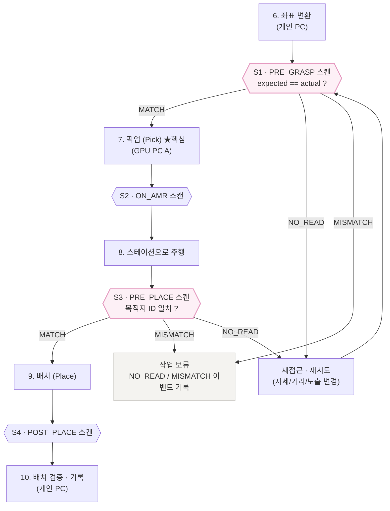

# 🔖 기능 확장 2 — QR코드 / 바코드 기반 생산 이력 추적 (Traceability)

> Isaac Sim_협동3 / 24.04+5.x / Development Process / Feature Extension 2
> 관련 문서: [01_Business_Requirements.md](01_Business_Requirements.md) · [02_System_Requirements.md](02_System_Requirements.md) · [용어정리.md](용어정리.md)

---

## 0. 한 줄 요약

> **매거진·트레이(스택)에 QR/바코드를 부착하고, RealSense 카메라로 판독해
> "어떤 캐리어가 언제·어디서·어디로 갔는지"를 DB에 append-only 이벤트로 남긴다.**
>
> 단, 이 기능의 본질은 *기록*이 아니라 **인터록(interlock)** 이다.
> ID가 확인되지 않으면 파지하지 않고, 목적지 ID가 일치하지 않으면 배치하지 않는다.
> 그래서 이 기능은 `BR-02(오배송 0건 · 로트 추적성 100%)`를 **"희망"에서 "증명 가능한 것"으로 바꾼다.**

### 원문 아이디어 (팀 노트)

> 제조업 단계에서 가장 중요한 것은 **어떤 공장/생산라인/롯트에서 생산이 되었는지를 추적** 가능한 것입니다.
> (이를 통해 불량 발생 시 원인 파악 및 개선이 용이해짐)
> 따라서 저희는 매거진 및 스택(배달 물체)에 해당 내용을 담은 QR코드 및 바코드를 부착한 뒤
> RealSense 카메라로 인식하여 언제 몇 시에 어떤 매거진/스택이 어디로 배달되었는지 DB에 정리할 예정입니다.

이 문서는 위 아이디어를 **① 왜 필요한가(설득 논리)** 와 **② 어떻게 만드는가(구현 설계)** 로 확장한 것이다.

---
---

# 1. 필요성 — 왜 추적성인가

## 1-1. 추적성은 "있으면 좋은 기능"이 아니라 **납품 조건**이다

제조업에서 추적성(traceability)은 품질 개선 도구를 넘어서, 법·표준·고객사 계약이 **요구하는 항목**으로 이동했다.

| 영역 | 무엇을 강제하는가 | 우리 프로젝트와의 접점 |
|---|---|---|
| **반도체 후공정 (SEMI 표준)** | `SEMI E87`(Carrier Management)은 캐리어 단위 관리와 **로드포트에서의 캐리어 ID 확인**을, `SEMI E90`(Substrate Tracking)은 기판이 어느 위치에 있는지의 **상태 추적**을 정의한다. `SEMI E99`는 캐리어 ID 리더/라이터 인터페이스를, `SEMI E88`은 스토커(AMHS 보관) 서비스를 다룬다. | 우리가 만드는 것이 정확히 **"스토커 ↔ 장비 사이의 캐리어 이송"** 이다. 즉 이 확장은 새로운 발명이 아니라 **업계 표준 모델을 우리 시스템에 맞춰 구현하는 것**이다. 고객사 MES에 붙일 때 말이 통한다. |
| **자동차 (IATF 16949)** | 부품 단위 추적성과 리콜 시 영향 범위 식별을 요구한다. | 우리 시나리오가 반도체지만, 동일 구조가 전장·모듈 라인에 그대로 적용된다 → 확장 시장 논거 |
| **의료기기 (FDA UDI / EU MDR)** | 라벨에 **기계 판독 가능한(AIDC) 식별자**를 요구한다. | "심볼 판독"이 규제의 기본 전제임을 보여주는 사례 |
| **EU 배터리 규정 (EU) 2023/1542** | 배터리 여권(Battery Passport)을 **QR코드**로 연결하도록 요구. 2027-02-18부터 적용. | 규제가 직접 **"QR코드"** 를 지목한 사례. 데이터 캐리어는 이미 규제 언어다 |
| **EU ESPR (EU) 2024/1781** | 디지털 제품 여권(DPP) 프레임워크. 품목군별 위임법으로 데이터 캐리어 부착을 확대 중. | 추적성 요구가 산업 전반으로 넓어지는 방향성 |
| **ISA-95 / IEC 62264, MESA-11** | MES 기능 모델에 **Product Tracking & Genealogy(제품 추적·계보)** 가 명시적으로 포함된다. | 우리가 만드는 DB가 MES의 어느 기능에 해당하는지 설명할 수 있다 |

> 💡 **발표 포인트**
> `01_Business_Requirements.md`는 "삼성전자가 자동화 없으면 납품 승인을 안 한다"를 근거로 든다.
> 그 무인화의 전제 조건이 **캐리어 ID 자동 확인**이다.
> 사람이 없어지면 "라벨을 눈으로 확인하고 맞는 장비에 넣던" 그 판단 주체도 같이 사라지기 때문이다.
> **무인화는 자동 식별 없이는 성립하지 않는다.** 이 확장은 무인화의 부가 기능이 아니라 **전제 조건**이다.

---

## 1-2. 추적성이 없을 때 치르는 비용 — "격리 범위"의 문제

불량이 발견됐을 때 진짜 비용은 불량품 자체가 아니라, **"어디까지 의심해야 하는가"** 에서 나온다.

| 추적 단위 | 불량 1건 발견 시 격리·재검사 범위 | 원인 규명 |
|---|---|---|
| 추적 없음 | 해당 기간 생산분 **전량** | 불가능 (추정만 가능) |
| 일자 단위 | 그날 생산분 전체 | 매우 어려움 |
| 로트 단위 | 해당 로트 전체 | 가능 (로트 공통 원인까지) |
| **캐리어 + 시각 단위 (본 확장)** | 해당 캐리어, 그리고 **같은 장비를 같은 시간대에 거쳐 간 캐리어만** | 가능 (장비·시간·경로별 교차 분석) |

`01_Business_Requirements.md`의 문제 정의 **①오배송·혼입** 은 이렇게 적혀 있다.

> "한 번 섞이면 **추적성이 무너져** 로트 전체를 재검사하거나 폐기해야 한다."

즉 **오배송의 비용은 "잘못 간 것" 자체가 아니라 "어디까지 섞였는지 모르는 것"** 이다.
캐리어 단위 스캔 이력이 있으면, 혼입이 발생해도 **영향 범위를 정확히 잘라낼 수 있다.**

**"불량을 없애는 기능"이 아니라 "불량이 났을 때 손실 범위를 좁히는 기능"** 이라는 점이 설득의 핵심이다.
불량률 0%는 약속할 수 없지만, **격리 범위 축소는 구조적으로 보장**된다.

---

## 1-3. 우리 프로젝트에 특히 필요한 이유 — 문서상의 구멍 메우기

현재 문서에는 **"트레이 ID"** 가 여러 번 등장한다.

| 출처 | 문장 |
|---|---|
| `01` BR-02 | "캐리어 ID ↔ 목적지 이력 **100% 기록**" |
| `01` 성공 기준 | "배치된 스테이션과 **트레이 ID의 목적지 매칭 검사**" |
| `02` 기능 플로우 2단계 | "이송 지시 발행 — **트레이 ID** ↔ 목적지 스테이션 매칭" |
| `02` 기능 플로우 5단계 | "트레이 인식 — 트레이 **종류 · ID 검출**" |

그런데 **그 ID를 무엇으로 읽는지는 어느 문서에도 정의되어 있지 않다.**
지금 상태로는 시뮬레이터가 내부적으로 알고 있는 prim 이름을 그냥 가져다 쓰게 되고,
그러면 **"오배송 0건"은 검증이 아니라 동어반복**이 된다.
(시뮬이 정답을 알려주고, 그 정답대로 옮겼으니 당연히 맞다.)

> ⚠️ **이것이 이 확장의 가장 강력한 논거다.**
> 심볼 판독을 넣으면, 로봇은 **시뮬레이터 내부 정보가 아니라 카메라로 본 것**으로 캐리어를 식별한다.
> 그때 비로소 "오배송 0건"이 **실제 인식 파이프라인을 통과한 결과**가 되고, 실물 라인에서도 같은 의미를 갖는다.

### 형상 인식만으로는 개체 식별이 불가능하다

| 질문 | 형상·색상 인식 (현재 계획) | 심볼 판독 (본 확장) |
|---|---|---|
| "이게 매거진인가 JEDEC 트레이인가?" | ✅ 가능 | ✅ 가능 |
| "이게 **A17번** 매거진인가 A18번인가?" | ❌ **불가능** (외형이 동일) | ✅ 가능 |
| "이 캐리어는 **어느 로트**인가?" | ❌ 불가능 | ✅ 가능 |
| "이 캐리어는 **어느 공장·라인**에서 왔나?" | ❌ 불가능 | ✅ 가능 |

랙에 똑같이 생긴 매거진이 20개 꽂혀 있을 때, 형상 인식은 "매거진 20개가 있다"까지만 말할 수 있다.
**개체(instance) 식별은 심볼 아니면 답이 없다.**

---

## 1-4. 왜 하필 QR / 바코드인가 — 대안 비교

| 방식 | 장점 | 단점 | 본 프로젝트 적합성 |
|---|---|---|---|
| **1D 바코드 (Code 128)** | 가장 싸다. 프린터만 있으면 된다. 사람도 숫자를 읽을 수 있다 | 데이터 용량 작고, 같은 정보를 담으려면 **가로로 길어져** 근거리에서 화각을 벗어남. 오염·긁힘에 약함 | ⭕ 보조 (사람 판독용 · 기존 라인 호환) |
| **QR코드 (ISO/IEC 18004)** | 정사각형이라 좁은 라벨에 고밀도. **회전 무관** 판독. 오류정정(ECC) L/M/Q/H = 약 7/15/25/30% 복구 | 금속 직접 각인(DPM)에는 Data Matrix보다 덜 쓰임 | ✅ **주력** |
| **Data Matrix (ISO/IEC 16022)** | 반도체·전자 업계의 **사실상 표준**. 아주 작게 만들어도 판독됨 | 소비자 인지도 낮음, 생성 라이브러리가 QR보다 적음 | ⭕ 실물 전개 시 1순위 대안 (구조 동일, 심볼만 교체) |
| **ArUco / AprilTag** | 아주 적은 픽셀로도 검출. **6-DoF 자세 추정**이 강력 | 담을 수 있는 정보가 ID 번호 하나뿐 | ✅ **병행** (원거리 슬롯/스테이션/도킹 식별) |
| **RFID** | 가림·오염에 강하고 비가시 판독, 쓰기 가능 | 태그 단가 높음, **금속 환경 간섭**, 리더 인프라 필요, 어느 태그를 읽었는지 **위치 특정이 어려움** | ❌ 이번 범위 밖 (단, 스키마는 동일 → 나중에 리더만 추가 가능) |
| **OCR (문자 인식)** | 기존 라벨 그대로 사용 | 오판독률 높고 조명·폰트에 민감. 체크섬 없음 | ❌ |

**결론: QR 주력 + ArUco 병행 + Code 128 보조.**
이유는 2-4절의 **픽셀/모듈 계산**에서 정량적으로 도출된다 (감이 아니라 수식으로 정한다).

> 📌 반도체 실물 라인에서 웨이퍼 FOUP는 RFID를 많이 쓰지만,
> 후공정의 **트레이·매거진은 소모성이고 수량이 많아 인쇄 라벨(1D/2D)이 지배적**이다.
> 우리 프로젝트의 대상(`01` 문서 기준: C-tray, JEDEC 트레이, 매거진)은 정확히 후자에 속한다.

---

## 1-5. 시뮬레이션에서 먼저 하는 것의 가치 — 그리고 정직한 한계

### 시뮬에서 검증되는 것 (진짜 가치)

1. **카메라 스펙 결정** — "판독하려면 라벨을 몇 mm로, 카메라를 몇 cm까지 접근시켜야 하나?"
   실물 카메라를 사기 **전에** 해상도·화각·접근 거리를 수식+실험으로 확정할 수 있다.
2. **스캔 포인트 안무(choreography)** — 사이클의 어느 순간에 스캔할 것인가.
   파지 전인가 후인가에 따라 실패 복구 비용이 완전히 달라진다. 이건 물리적 동선 설계 문제다.
3. **인터록 로직 전체** — ID 불일치 시 파지/배치를 중단하는 상태 기계. **코드는 실물과 100% 동일하다.**
4. **DB 스키마와 질의** — 계보 질의가 실제로 답을 주는지, 스키마가 충분한지.
5. **실패 시나리오 반복** — 미판독(no-read)이 났을 때의 재시도 동작을 수백 번 안전하게 돌려볼 수 있다.

### 정직한 한계 (반드시 문서에 남길 것)

> ⚠️ **시뮬에서 렌더링된 QR은 실물보다 읽기 쉽다.**
> 초점이 완벽하고, 모션 블러가 없고, 라벨이 구겨지거나 더럽지 않고, 정반사 하이라이트가 없다.
> 그대로 실험하면 **판독률 100%가 나오고, 그 숫자는 아무 의미가 없다.**

따라서 **도메인 랜덤화(2-12절)로 열화를 의도적으로 주입해야** 판독률 수치가 의미를 갖는다.
이 한계를 먼저 인정하고 대책을 제시하는 것이, 발표에서 오히려 신뢰를 높인다.

---

## 1-6. 발표용 한 문장

> "현재 설계에서 '트레이 ID'는 시뮬레이터가 알려주는 값입니다.
> 그러면 오배송 0건은 검증이 아니라 동어반복입니다.
> QR을 붙이고 카메라로 읽으면, 로봇은 **본 것으로** 판단하게 되고,
> ID가 일치하지 않으면 **파지도 배치도 하지 않습니다.**
> 그 판단 하나하나가 DB에 시각과 위치와 함께 남아서,
> 불량이 났을 때 **'같은 시간에 같은 장비를 지나간 캐리어'만 정확히 격리**할 수 있게 됩니다."

---
---

# 2. 구현 방법

## 2-0. 전체 아키텍처

```mermaid
flowchart LR
    subgraph OFF["① 오프라인 (사전 준비)"]
        A1["코드 체계 설계<br/>payload schema"]
        A2["라벨 PNG 생성<br/>qrcode / python-barcode"]
        A3["USD에 디칼 부착<br/>UsdShade + OmniPBR"]
        A1 --> A2 --> A3
    end

    subgraph SIM["② GPU PC A — Isaac Sim 5.x"]
        B1["캐리어 prim<br/>+ QR 디칼"]
        B2["RealSense D455<br/>손목 / 랙 고정"]
        B3["OmniGraph<br/>ROS2CameraHelper"]
        B1 --> B2 --> B3
    end

    subgraph VIS["③ GPU PC B — cobot3_perception"]
        C1["carrier_code_reader_node<br/>ROI → 전처리 → 디코드"]
        C2["N-of-M 다수결<br/>+ 스키마·체크섬 검증"]
        C3["심볼 3D 위치 산출<br/>depth + camera_info + TF"]
        C1 --> C2 --> C3
    end

    subgraph ORC["④ 개인 PC — cobot3_orchestrator"]
        D1["VerifyCarrier 서비스<br/>★ 인터록"]
        D2["traceability_logger_node"]
        D3[("PostgreSQL<br/>scan_event / carrier / job")]
        D4["Grafana 대시보드"]
        D1 --> D2 --> D3 --> D4
    end

    A3 -.USD.-> B1
    B3 --"/wrist_cam/color/image_raw<br/>/camera_info"--> C1
    C3 --"/perception/carrier_scan"--> D1
    D1 --"파지/배치 허가·거부"--> B1

    style D1 fill:#fdf0f6,stroke:#e59ac0,stroke-width:2px
    style C1 fill:#f0edfa,stroke:#b7a9e8
    style D3 fill:#f4f3f0,stroke:#cfcdc8
```



### 담당 PC 배치 (`02` 문서의 3-PC 구성을 그대로 따름)

| 단계 | 담당 | 근거 |
|---|---|---|
| 라벨 생성 · USD 부착 | 개인 PC (오프라인) → 결과물만 GPU PC A로 | 렌더링 자원 불필요 |
| 렌더링 · 이미지 퍼블리시 | **GPU PC A** | 이미 카메라 퍼블리시 담당 |
| 심볼 디코딩 | **GPU PC B** | 이미 비전 추론 담당. CPU 작업이라 추론과 충돌 적음 |
| 인터록 판정 · DB 기록 | **개인 PC** | 이미 좌표 변환·오케스트레이션·로그 담당 |

---

## 2-1. Step 1 — 코드 체계 설계 (가장 먼저, 가장 중요)

### 원칙: **심볼에는 "키"만, 나머지는 전부 DB에**

심볼에 정보를 많이 담을수록 → 모듈 수 증가 → 라벨이 커지거나 판독 거리가 짧아진다.
실제 팹에서도 캐리어 심볼은 **식별자 하나**만 담고, 나머지는 MES가 갖고 있다.

```
❌ 나쁜 예 (정보를 다 담음, 78자 → QR Version 5+ 필요, 판독 거리 급감)
   PLANT=화성2공장;LINE=패키징3라인;LOT=20240915-A;TYPE=MAGAZINE;SN=A17;QTY=25

✅ 좋은 예 (키만, 28자 → QR Version 2로 충분)
   C3.P2.L3.MAG.A17.240915.07.G
```

### 페이로드 포맷 정의

```
C3 . P2 . L3 . MAG . A17 . 240915 . 07 . G
│    │    │    │     │     │        │    └─ 체크문자 (mod-36, 1자)
│    │    │    │     │     │        └────── 로트 내 순번 (2자)
│    │    │    │     │     └─────────────── 로트 생성일 YYMMDD (6자)
│    │    │    │     └───────────────────── 캐리어 일련번호 (3자)
│    │    │    └─────────────────────────── 캐리어 타입 MAG|JED|CTR (3자)
│    │    └──────────────────────────────── 생산라인 코드 (2자)
│    └───────────────────────────────────── 공장 코드 (2자)
└────────────────────────────────────────── 스키마 태그 = 프로젝트 식별 (2자)

전체 28자 → QR 영숫자 모드 · Version 2 (25×25) · ECC Level Q(25% 복구) 에 수용
```

> 🔧 **구분자로 `.` 와 `-` 를 쓰는 이유**
> QR 영숫자(alphanumeric) 모드가 지원하는 문자는 `0-9 A-Z(대문자) 공백 $ % * + - . / :` 뿐이다.
> `|` 나 소문자를 쓰면 **바이트 모드로 떨어져 용량이 약 1.6배 늘어난다** (V2-Q 기준 29자 → 20자).
> 구분자 하나 잘못 고르면 라벨이 커지고 판독 거리가 짧아진다.

### QR 버전 · ECC 선택표

| 버전 | 모듈 | 영숫자 용량 (L/M/Q/H) | 본 프로젝트 판단 |
|---|---|---|---|
| V1 | 21×21 | 25 / 20 / 16 / 10 | ❌ 28자 수용 불가 |
| **V2** | **25×25** | **47 / 38 / 29 / 20** | ✅ **채택 (ECC Q = 29자)** |
| V3 | 29×29 | 77 / 61 / 47 / 35 | ⭕ 여유가 필요하면 (단 라벨 12% 커짐) |

- **ECC Q(25%)** 선택 이유: 클린룸이라 오염이 적은 편이지만, 라벨 긁힘·부분 가림을 견뎌야 한다.
  H(30%)는 복구력이 가장 높지만 같은 정보에 더 큰 버전을 요구해 판독 거리가 줄어든다. **Q가 균형점.**
- **Quiet zone(여백) 4모듈**은 ISO/IEC 18004 규격 요구사항이다. 생략하면 판독률이 급락한다.
  → 실효 크기 = 25 + 4 + 4 = **33 모듈**. 이 값이 2-4절 계산에 그대로 들어간다.

### 보조 1D 바코드 (Code 128)

사람이 눈으로 확인하거나 기존 핸디 스캐너와 호환할 용도로, 같은 라벨 하단에 `MAG-A17`만 짧게 인쇄.
1D는 같은 정보를 담을 때 **가로로 훨씬 길어지므로** 주 식별자로는 쓰지 않는다.

---

## 2-2. Step 2 — 라벨 이미지 생성

```bash
pip install qrcode[pil] python-barcode pillow
```

`tools/gen_carrier_labels.py` (신규):

```python
"""캐리어 ID → 라벨 PNG (QR + Code128 + 사람이 읽는 텍스트) 생성기."""
import qrcode
from qrcode.constants import ERROR_CORRECT_Q
from barcode import Code128
from barcode.writer import ImageWriter
from PIL import Image, ImageDraw, ImageFont

MODULE_PX = 16          # 모듈 1개당 픽셀 — 나중에 확대하지 말고 처음부터 크게 만든다
QUIET_MODULES = 4       # ISO/IEC 18004 요구 여백


def mod36_check(s: str) -> str:
    """단순 mod-36 체크문자. 오판독(misread)을 애플리케이션 레벨에서 한 번 더 거른다."""
    table = "0123456789ABCDEFGHIJKLMNOPQRSTUVWXYZ"
    total = sum(table.index(c) for c in s if c in table)
    return table[total % 36]


def build_payload(plant, line, ctype, serial, lot_date, lot_seq) -> str:
    body = f"C3.{plant}.{line}.{ctype}.{serial}.{lot_date}.{lot_seq}"
    return f"{body}.{mod36_check(body)}"


def make_qr(payload: str) -> Image.Image:
    qr = qrcode.QRCode(
        version=2,                      # 25x25 로 고정 — 페이로드가 길어져 버전이 튀면 즉시 알 수 있다
        error_correction=ERROR_CORRECT_Q,
        box_size=MODULE_PX,
        border=QUIET_MODULES,
    )
    qr.add_data(payload)
    qr.make(fit=False)                  # fit=False: 버전 자동 상향을 막는다 (크기 예측 가능성 유지)
    return qr.make_image(fill_color="black", back_color="white").convert("RGB")


def make_label(payload: str, carrier_id: str, out_path: str):
    qr_img = make_qr(payload)
    w = qr_img.width
    label = Image.new("RGB", (w, w + 180), "white")
    label.paste(qr_img, (0, 0))

    # 1D 바코드 (사람·핸디스캐너 호환용)
    bc = Code128(carrier_id, writer=ImageWriter()).render(
        {"module_height": 8.0, "font_size": 0, "quiet_zone": 2.0}
    )
    bc = bc.resize((w, 110), Image.NEAREST)
    label.paste(bc, (0, w + 10))

    # 사람이 읽는 텍스트
    draw = ImageDraw.Draw(label)
    font = ImageFont.load_default(size=40)
    draw.text((8, w + 128), carrier_id, fill="black", font=font)

    label.save(out_path)                # PNG (무손실) — JPEG 금지, 압축 아티팩트가 모듈을 뭉갠다
    print(f"{out_path}  payload={payload}  {len(payload)}자")


if __name__ == "__main__":
    for i in range(1, 21):
        sn = f"A{i:02d}"
        payload = build_payload("P2", "L3", "MAG", sn, "240915", f"{i:02d}")
        make_label(payload, f"MAG-{sn}", f"assets/labels/MAG-{sn}.png")
```

> ⚠️ **PNG로 저장할 것.** JPEG의 블록 압축은 QR 모듈 경계를 뭉개서 판독률을 떨어뜨린다.
> 그리고 **작게 만든 뒤 확대하지 말 것.** 보간(interpolation) 때문에 모듈이 흐려진다.
> 처음부터 `MODULE_PX=16` 으로 크게 만들고, 텍스처 샘플링은 GPU에 맡긴다.

---

## 2-3. Step 3 — Isaac Sim USD에 QR 부착하기

### 접근 방식: **얇은 쿼드 메시(디칼)를 캐리어 prim의 자식으로**

캐리어 본체 메시의 UV를 건드리지 않고, **라벨 평면을 하나 더 붙이는 방식**이 압도적으로 간단하고 안전하다.
(본체 UV를 수정하면 캐리어 3종마다 다시 작업해야 한다.)

```
/World/Stocker/Rack_A/Slot_07/Magazine_A17     ← 캐리어 (RigidBody)
└── /Label                                      ← Xform
    └── /Label/Quad                             ← UsdGeom.Mesh (4-vertex, st primvar 포함)
        └── binding → /World/Looks/QR_MAG_A17   ← UsdShade.Material (OmniPBR)
```

`tools/attach_label_to_usd.py` (신규):

```python
"""캐리어 prim에 QR 라벨 디칼(쿼드 + OmniPBR 머티리얼)을 부착한다."""
from pxr import Usd, UsdGeom, UsdShade, Sdf, Gf

LABEL_W = 0.050          # 라벨 가로 [m] — 2-4절 계산 결과로 결정할 것
LABEL_H = 0.050
SURFACE_OFFSET = 0.0008  # 0.8 mm 띄움: z-fighting 방지 (핵심)


def create_label_material(stage, mat_path: str, texture_path: str):
    material = UsdShade.Material.Define(stage, mat_path)
    shader = UsdShade.Shader.Define(stage, f"{mat_path}/Shader")
    shader.CreateIdAttr("OmniPBR")
    shader.SetSourceAsset(Sdf.AssetPath("OmniPBR.mdl"), "mdl")
    shader.SetSourceAssetSubIdentifier("OmniPBR", "mdl")

    shader.CreateInput("diffuse_texture", Sdf.ValueTypeNames.Asset).Set(
        Sdf.AssetPath(texture_path)
    )
    # ↓ 판독 성패를 가르는 3줄 — 무광 종이 라벨을 흉내낸다
    shader.CreateInput("reflection_roughness_constant",
                       Sdf.ValueTypeNames.Float).Set(0.9)   # 정반사 하이라이트 억제
    shader.CreateInput("metallic_constant",
                       Sdf.ValueTypeNames.Float).Set(0.0)
    shader.CreateInput("specular_level",
                       Sdf.ValueTypeNames.Float).Set(0.1)

    material.CreateSurfaceOutput("mdl").ConnectToSource(
        shader.ConnectableAPI(), "out"
    )
    return material


def create_label_quad(stage, quad_path: str, w: float, h: float):
    mesh = UsdGeom.Mesh.Define(stage, quad_path)
    hw, hh = w / 2.0, h / 2.0
    mesh.CreatePointsAttr([(-hw, -hh, 0), (hw, -hh, 0), (hw, hh, 0), (-hw, hh, 0)])
    mesh.CreateFaceVertexCountsAttr([4])
    mesh.CreateFaceVertexIndicesAttr([0, 1, 2, 3])
    mesh.CreateNormalsAttr([(0, 0, 1)] * 4)
    mesh.CreateDoubleSidedAttr(False)

    # UV(st) primvar — 이게 없으면 텍스처가 전혀 보이지 않는다
    primvars = UsdGeom.PrimvarsAPI(mesh)
    st = primvars.CreatePrimvar(
        "st", Sdf.ValueTypeNames.TexCoord2fArray, UsdGeom.Tokens.varying
    )
    st.Set([(0, 0), (1, 0), (1, 1), (0, 1)])
    return mesh


def attach_label(stage, carrier_path: str, texture_path: str, carrier_id: str,
                 local_pos=(0.0, -0.06, 0.04), local_rot_xyz=(90.0, 0.0, 0.0)):
    label_xform = UsdGeom.Xform.Define(stage, f"{carrier_path}/Label")
    xf = UsdGeom.Xformable(label_xform)
    xf.AddTranslateOp().Set(Gf.Vec3d(*local_pos))
    xf.AddRotateXYZOp().Set(Gf.Vec3f(*local_rot_xyz))

    quad = create_label_quad(stage, f"{carrier_path}/Label/Quad", LABEL_W, LABEL_H)
    UsdGeom.Xformable(quad).AddTranslateOp().Set(Gf.Vec3d(0, 0, SURFACE_OFFSET))

    mat = create_label_material(stage, f"/World/Looks/QR_{carrier_id}", texture_path)
    UsdShade.MaterialBindingAPI(quad.GetPrim()).Bind(mat)

    # 디칼은 물리에 참여하지 않는다 (충돌·질량 계산에서 제외)
    quad.GetPrim().CreateAttribute(
        "physics:collisionEnabled", Sdf.ValueTypeNames.Bool
    ).Set(False)
    return quad
```

### 부착 시 반드시 지켜야 할 것 — 체크리스트

| 항목 | 이유 | 증상 (안 지켰을 때) |
|---|---|---|
| **0.5~1 mm 표면 오프셋** | z-fighting 방지 | 라벨이 깜빡이거나 줄무늬로 찢어져 보임 → 판독 불가 |
| **`st` primvar 명시** | `UsdGeom.Cube`/`Plane`은 기본 UV가 없을 수 있음 | 텍스처가 안 보이고 회색 면만 보임 |
| **roughness 0.9 / metallic 0** | 정반사 하이라이트가 흰 모듈을 날려버림 | 조명 각도에 따라 **간헐적 미판독** — 재현이 어려워 디버깅 지옥 |
| **collision 비활성** | 디칼이 그리퍼와 충돌하면 안 됨 | 파지 실패율이 원인 불명으로 상승 |
| **캐리어의 자식으로 배치** | 캐리어가 움직일 때 라벨이 따라가야 함 | 라벨이 공중에 남음 |
| **텍스처 colorSpace = sRGB** | 감마가 틀어지면 대비 저하 | 판독률 하락 (특히 저조도 실험에서) |
| **DLSS/업스케일링 확인** | 업스케일링이 미세 텍스처를 뭉갤 수 있음 | 해상도를 올려도 판독률이 안 오름 |

> 🔧 **디버그 팁**: 판독이 전혀 안 될 때는 머티리얼을 임시로 **emissive(자체발광)** 로 바꿔서
> 조명 영향을 0으로 만든 뒤 테스트해 본다. 그때 판독되면 원인은 **조명/반사**, 여전히 안 되면 **해상도/UV/텍스처 경로**다.
> 단, 최종 실험은 반드시 diffuse(무광)로 되돌려서 한다. emissive는 현실에 없다.

### 로트별 라벨 교체 — Replicator로 자동화

반복 시행마다 캐리어 ID를 바꾸려면 USD를 매번 고치는 대신 **텍스처만 갈아 끼운다.**

```python
import omni.replicator.core as rep

label_quads = rep.get.prims(path_pattern="/World/.*/Label/Quad")
textures = [f"assets/labels/MAG-A{i:02d}.png" for i in range(1, 21)]

with rep.trigger.on_frame(interval=1):
    with label_quads:
        rep.randomizer.texture(textures=textures)
```

> 이때 **시뮬레이터가 아는 정답(어느 prim에 어느 텍스처가 붙었는가)** 을 같이 로그로 남겨야
> 나중에 판독 결과와 대조해 **오판독(misread)** 을 셀 수 있다. (2-12절 실험의 정답 레이블)

---

## 2-4. Step 4 — "얼마나 가까이 가야 읽히는가" — 카메라 설계 수식

여기가 이 문서에서 **감이 아니라 계산으로 결정되는** 부분이다.

### 수식

```
카메라 초점거리(픽셀):    fx = (이미지_가로_px / 2) / tan(HFOV / 2)

심볼의 화면상 가로 픽셀:   px_symbol = fx × (W_symbol / Z)

모듈당 픽셀:              px_per_module = px_symbol / N_modules
                                        = fx × W_symbol / (Z × N_modules)

판독 조건:                px_per_module ≥ 3  (최소)    /    ≥ 4  (권장)

∴ 최대 판독 거리:         Z_max = fx × W_symbol / (k × N_modules)      (k = 3 또는 4)
```

- `N_modules` = 25(V2) + 4 + 4(quiet zone) = **33**
- `fx` 는 시뮬이 퍼블리시하는 `camera_info`의 K[0] 값을 그대로 쓴다 (추측하지 말 것)
- RealSense D455 컬러 스트림 기준 (HFOV ≈ 90°, 1280×720) → `fx ≈ 640`

### 계산 결과 — 라벨 크기별 최대 판독 거리 [m]

| 라벨 가로 W | 1280×720 (fx≈640)<br/>최소 3px/모듈 | 1280×720<br/>**권장 4px/모듈** | 1920×1080 (fx≈960)<br/>최소 3px/모듈 | 1920×1080<br/>**권장 4px/모듈** |
|---|---|---|---|---|
| 25 mm | 0.16 | 0.12 | 0.24 | 0.18 |
| 30 mm | 0.19 | 0.15 | 0.29 | 0.22 |
| **40 mm** | 0.26 | **0.19** | 0.39 | **0.29** |
| **50 mm** | 0.32 | **0.24** | 0.48 | **0.36** |
| 80 mm | 0.52 | 0.39 | 0.78 | 0.58 |

### ✅ 실측 검증 — "3 px/모듈"은 경험칙이 아니라 우리가 측정한 값이다

위 표의 임계값(`k = 3` 최소 / `4` 권장)을 실제로 측정했다.
QR을 모듈당 픽셀 수를 낮춰가며 렌더링하고, **실제 카메라가 만드는 열화**를 주입한 뒤 zxing-cpp로 디코딩했다.

주입한 열화:
- **서브픽셀 정렬 어긋남** (±0.5 px) — 실제 카메라는 절대 심볼과 픽셀 격자가 정렬되지 않는다
- **미소 회전** (±8°)
- **가우시안 블러** σ = 0.8 / 1.2 (초점 흐림·모션 블러)
- **가우시안 노이즈** σ = 12 (저조도 센서 노이즈)

각 조건 30회 시행, 페이로드는 `C3.P2.L3.MAG.A17.240915.07.G` (V2 · ECC-Q · 33모듈).

| 조건 | 1.5 px | 2.0 px | 2.5 px | 3.0 px | 3.5 px | 4.0 px | **판독률 100% 임계** |
|---|---|---|---|---|---|---|---|
| 열화 없음 (= 이상적 시뮬) | 93 % | 100 % | 100 % | 100 % | 100 % | 100 % | **2.0** |
| 블러 σ=0.8 | 0 % | 100 % | 100 % | 100 % | 100 % | 100 % | **2.0** |
| 블러 σ=0.8 + 노이즈 σ=12 | 0 % | 0 % | 37 % | 100 % | 100 % | 100 % | **3.0** |
| 블러 σ=1.2 + 노이즈 σ=12 | 0 % | 0 % | 0 % | 50 % | 97 % | 100 % | **4.0** |

**이 측정이 말해 주는 것 3가지:**

1. **`k=3`(최소) / `k=4`(권장) 기준이 실측으로 확인됐다.**
   현실적 열화 조건에서 정확히 3.0 px/모듈에서 100%가 되고, 열화가 심해지면 4.0이 필요하다.
   → 2-4절 거리 표를 그대로 설계에 써도 된다.

2. **열화가 없으면 2.0 px/모듈에서도 100%가 나온다 — 이것이 1-5절에서 경고한 함정이다.**
   깨끗한 시뮬 렌더링만으로 실험하면 **실제보다 1.5~2배 낙관적인 결과**가 나온다.
   도메인 랜덤화(2-12절)가 선택이 아니라 필수인 이유가 여기에 있다.

3. **노이즈가 블러보다 치명적이다.**
   블러 σ=0.8만 있을 때는 2.0 px에서도 100%였지만, 노이즈를 더하자 3.0 px가 필요해졌다.
   → **저조도 대응(조명 확보·노출 조정)이 초점 맞추기보다 우선순위가 높다.**

<details>
<summary>측정 재현 스크립트 (펼치기)</summary>

```python
"""모듈당 픽셀 수를 낮춰가며 판독 임계값을 측정한다."""
import cv2
import numpy as np
import qrcode
import zxingcpp
from qrcode.constants import ERROR_CORRECT_Q

PAYLOAD = "C3.P2.L3.MAG.A17.240915.07.G"


def render_big(version=2, ecc=ERROR_CORRECT_Q):
    qr = qrcode.QRCode(version=version, error_correction=ecc, box_size=40, border=4)
    qr.add_data(PAYLOAD)
    qr.make(fit=False)
    img = np.array(qr.make_image(fill_color="black", back_color="white").convert("L"))
    return img, len(qr.get_matrix())        # n = 33 (quiet zone 포함)


def sample(big, n, k, rng, blur_sigma, noise_sigma):
    """카메라처럼 임의의 서브픽셀 위상과 미소 회전으로 샘플링한다."""
    target = int(round(n * k))
    canvas = int(target * 1.6)
    out = np.full((canvas, canvas), 255, np.uint8)
    off = (canvas - target) // 2
    out[off:off + target, off:off + target] = cv2.resize(
        big, (target, target), interpolation=cv2.INTER_AREA)

    dx, dy = rng.uniform(-0.5, 0.5, 2)                  # 서브픽셀 어긋남
    M = cv2.getRotationMatrix2D((canvas / 2, canvas / 2), rng.uniform(-8, 8), 1.0)
    M[0, 2] += dx
    M[1, 2] += dy
    out = cv2.warpAffine(out, M, (canvas, canvas), flags=cv2.INTER_LINEAR,
                         borderMode=cv2.BORDER_CONSTANT, borderValue=255)

    if blur_sigma > 0:
        out = cv2.GaussianBlur(out, (0, 0), blur_sigma)
    if noise_sigma > 0:
        out = np.clip(out.astype(np.int16)
                      + rng.normal(0, noise_sigma, out.shape), 0, 255).astype(np.uint8)
    return out


def sweep(blur_sigma, noise_sigma, trials=30):
    rng = np.random.default_rng(42)
    big, n = render_big()
    for k in [1.5, 2.0, 2.5, 3.0, 3.5, 4.0, 5.0]:
        hit = sum(
            any(h.text == PAYLOAD for h in zxingcpp.read_barcodes(
                sample(big, n, k, rng, blur_sigma, noise_sigma)))
            for _ in range(trials))
        print(f"  {k} px/module : {100 * hit / trials:5.1f} %")


if __name__ == "__main__":
    for bs, ns in [(0.0, 0), (0.8, 0), (0.8, 12), (1.2, 12)]:
        print(f"[블러 σ={bs}, 노이즈 σ={ns}]")
        sweep(bs, ns)
```

</details>

> 🔧 **덤으로 확인된 것**: 같은 28자 페이로드를 **V2 + ECC-H** 로 만들면
> `DataOverflowError`가 난다 (V2-H 영숫자 용량 20자 < 28자).
> 2-1절 버전/ECC 표가 실제 라이브러리 동작과 일치함을 확인했다.
> ECC-H가 꼭 필요하면 V3(29×29)로 올려야 하고, 그러면 라벨이 12% 커지거나 판독 거리가 그만큼 짧아진다.


### 여기서 나오는 **설계 결론 3가지**

> **① 스캔은 손목 카메라(eye-in-hand)의 pre-grasp 자세에서 한다.**
> 50 mm 라벨 + 1280×720 기준 권장 판독 거리는 **0.24 m**.
> 파지 직전 접근 자세가 보통 0.15~0.30 m이므로 **정확히 그 구간에 들어온다.**
> 별도 스캔 동작을 추가할 필요가 없다 — **사이클 타임 증가 ≈ 0.**

> **② 랙 고정 카메라(약 1.5 m)로는 QR을 읽을 수 없다.**
> 1.5 m에서 4px/모듈을 만족하려면 라벨이 `1.5 × 4 × 33 / 640 ≈ 309 mm` 필요 → 비현실적.
> 따라서 **랙 카메라는 QR 판독 담당이 아니다.** 슬롯 점유 탐색은 기존 역할 그대로 두고,
> 슬롯 번호 식별이 필요하면 **ArUco**를 쓴다.

> **③ 그래서 ArUco를 병행한다.**
> ArUco `DICT_4X4_50`은 데이터 4×4 + 테두리 1모듈 = **6모듈**뿐이다.
> 80 mm ArUco의 이론 판독 거리 = `640 × 0.08 / (3 × 6) ≈ 2.8 m` (실무 보수적으로 1.5 m).
> **QR 대비 약 5배 원거리.** 대신 담을 수 있는 건 ID 숫자 하나뿐.
>
> → **역할 분담: 원거리 "어느 슬롯/스테이션인가" = ArUco, 근거리 "어느 캐리어·로트인가" = QR.**

### Isaac Sim 카메라 설정

```python
# 실물 D455와 fx를 맞춘다 — 이게 안 맞으면 위 표가 전부 무의미해진다
from pxr import UsdGeom
import math

cam = UsdGeom.Camera(stage.GetPrimAtPath("/World/.../wrist_cam"))
HFOV_DEG, IMG_W = 90.0, 1280
h_aperture = 20.955                                  # [mm] 관례값 (1인치 센서 가로)
f_mm = (h_aperture / 2.0) / math.tan(math.radians(HFOV_DEG / 2.0))

cam.GetFocalLengthAttr().Set(f_mm)
cam.GetHorizontalApertureAttr().Set(h_aperture)
# fx[px] = f_mm / h_aperture * IMG_W  → camera_info 의 K[0] 과 일치해야 한다
```

OmniGraph로 ROS 2 퍼블리시 (기존 `isaacpjt/M0609/lula_ik/7_pick_place_color2.py`의 `og.Controller.edit` 패턴과 동일):

```python
import omni.graph.core as og

og.Controller.edit(
    {"graph_path": "/World/ROS2_WristCam", "evaluator_name": "execution"},
    {
        og.Controller.Keys.CREATE_NODES: [
            ("OnTick",      "omni.graph.action.OnPlaybackTick"),
            ("Context",     "isaacsim.ros2.bridge.ROS2Context"),
            ("RenderProd",  "isaacsim.core.nodes.IsaacCreateRenderProduct"),
            ("RGBPub",      "isaacsim.ros2.bridge.ROS2CameraHelper"),
            ("InfoPub",     "isaacsim.ros2.bridge.ROS2CameraInfoHelper"),
        ],
        og.Controller.Keys.SET_VALUES: [
            ("RenderProd.inputs:cameraPrim", "/World/.../wrist_cam"),
            ("RenderProd.inputs:width",  1280),   # ← 판독률 실험의 핵심 변수
            ("RenderProd.inputs:height",  720),
            ("RGBPub.inputs:type",      "rgb"),
            ("RGBPub.inputs:topicName", "/wrist_cam/color/image_raw"),
            ("RGBPub.inputs:frameId",   "wrist_cam_color_optical_frame"),
            ("InfoPub.inputs:topicName", "/wrist_cam/color/camera_info"),
        ],
        og.Controller.Keys.CONNECT: [
            ("OnTick.outputs:tick",                "RenderProd.inputs:execIn"),
            ("RenderProd.outputs:execOut",         "RGBPub.inputs:execIn"),
            ("RenderProd.outputs:renderProductPath", "RGBPub.inputs:renderProductPath"),
            ("RenderProd.outputs:renderProductPath", "InfoPub.inputs:renderProductPath"),
            ("Context.outputs:context",            "RGBPub.inputs:context"),
        ],
    },
)
```

> 📌 **기존 코드와의 정합성**: 현재 `src/m0609/m0609/m0609_color_detector.py`는 `/rgb` 토픽을 구독한다.
> 확장하면서 `/wrist_cam/color/image_raw` 로 정리하되, **기존 노드는 launch 파일에서 remap**으로 흡수한다.
> 이 이름은 실물 `realsense2_camera` 드라이버의 토픽 구조와 맞춰 둔 것이라, **sim → real 전환 시 코드 수정이 0이다.**
> (드라이버 버전에 따라 네임스페이스가 `/camera/camera/...` 로 달라질 수 있으므로 remap으로 처리한다.)

---

## 2-5. Step 5 — ROS 2 판독 노드

### 디코더 라이브러리 선정

| 라이브러리 | 지원 심볼 | 특징 | 판단 |
|---|---|---|---|
| **zxing-cpp** (`pip install zxing-cpp`) | QR, Data Matrix, Code128, EAN 등 다수 | C++ 백엔드로 빠르고 robust. **Data Matrix 지원**이 실물 전환 시 결정적 | ✅ **주력** |
| **pyzbar** (`apt install libzbar0` 필요) | QR, Code128, EAN 등 | 오래되고 안정적 | ⭕ 교차검증용 폴백 |
| `cv2.QRCodeDetector` | QR만 | OpenCV 내장, 추가 설치 불필요 | ⭕ 최소 스파이크용 |
| `cv2.wechat_qrcode_*` | QR만 | 작고 흐린 QR에 강함 (opencv-contrib 필요) | ⭕ 저조도 대비책 |

**2개 이상을 동시에 돌려 교차 검증**하면 오판독을 더 줄일 수 있다 (성능 여유가 있을 때).

### `src/cobot3_perception/cobot3_perception/carrier_code_reader_node.py` (신규)

```python
"""
캐리어 라벨(QR/바코드) 판독 노드

입력 토픽:
    /wrist_cam/color/image_raw      sensor_msgs/Image
    /wrist_cam/color/camera_info    sensor_msgs/CameraInfo
    /wrist_cam/depth/image_rect_raw sensor_msgs/Image  (정렬된 depth)

출력 토픽:
    /perception/carrier_scan        cobot3_interfaces/CarrierScan
    /perception/carrier_scan_debug  sensor_msgs/Image
"""
import re
import time
from collections import Counter, deque

import cv2
import numpy as np
import rclpy
import zxingcpp
from cv_bridge import CvBridge
from rclpy.node import Node
from rclpy.qos import qos_profile_sensor_data
from sensor_msgs.msg import CameraInfo, Image

from cobot3_interfaces.msg import CarrierScan

# C3.P2.L3.MAG.A17.240915.07.G
PAYLOAD_RE = re.compile(
    r"^C3\.([A-Z0-9]{2})\.([A-Z0-9]{2})\.(MAG|JED|CTR)\."
    r"([A-Z0-9]{3})\.(\d{6})\.(\d{2})\.([A-Z0-9])$"
)


def mod36_check(s: str) -> str:
    table = "0123456789ABCDEFGHIJKLMNOPQRSTUVWXYZ"
    return table[sum(table.index(c) for c in s if c in table) % 36]


def validate(payload: str):
    """스키마 + 체크문자 검증. 여기를 통과 못 하면 '못 읽은 것'으로 취급한다."""
    m = PAYLOAD_RE.match(payload)
    if not m:
        return None
    body = payload.rsplit(".", 1)[0]
    if mod36_check(body) != m.group(7):
        return None
    plant, line, ctype, serial, lot_date, lot_seq, _ = m.groups()
    return {
        "carrier_id": f"{ctype}-{serial}",
        "carrier_type": ctype,
        "lot_id": f"{plant}{line}-{lot_date}-{lot_seq}",
        "plant_id": plant,
        "line_id": line,
    }


def preprocess(bgr):
    """디코드 후보 이미지들을 만든다. 하나라도 성공하면 된다."""
    gray = cv2.cvtColor(bgr, cv2.COLOR_BGR2GRAY)
    yield gray                                              # 원본

    clahe = cv2.createCLAHE(clipLimit=2.5, tileGridSize=(8, 8))
    eq = clahe.apply(gray)
    yield eq                                                # 대비 보정 (저조도 대응)

    blur = cv2.GaussianBlur(eq, (0, 0), 2.0)
    yield cv2.addWeighted(eq, 1.6, blur, -0.6, 0)           # 언샤프 (초점 흐림 대응)

    yield cv2.adaptiveThreshold(                            # 국소 이진화 (하이라이트 대응)
        eq, 255, cv2.ADAPTIVE_THRESH_GAUSSIAN_C, cv2.THRESH_BINARY, 31, 5
    )


class CarrierCodeReader(Node):

    def __init__(self):
        super().__init__("carrier_code_reader")
        self.declare_parameter("decode_hz", 5.0)      # 30Hz 전부 디코드할 필요 없다
        self.declare_parameter("roi_fraction", 0.6)   # 중앙 60%만 본다 (속도 + 오검출 억제)
        self.declare_parameter("vote_window", 5)      # N-of-M 다수결
        self.declare_parameter("vote_required", 3)

        self.bridge = CvBridge()
        self.K = None
        self.depth = None
        self.votes = deque(maxlen=int(self.get_parameter("vote_window").value))
        self.last_decode = 0.0

        self.pub = self.create_publisher(
            CarrierScan, "/perception/carrier_scan", 10)
        self.debug_pub = self.create_publisher(
            Image, "/perception/carrier_scan_debug", qos_profile_sensor_data)

        self.create_subscription(
            CameraInfo, "/wrist_cam/color/camera_info",
            lambda m: setattr(self, "K", np.array(m.k).reshape(3, 3)),
            qos_profile_sensor_data)
        self.create_subscription(
            Image, "/wrist_cam/depth/image_rect_raw",
            self.on_depth, qos_profile_sensor_data)
        self.create_subscription(
            Image, "/wrist_cam/color/image_raw",
            self.on_image, qos_profile_sensor_data)

        self.get_logger().info("carrier_code_reader 시작: /wrist_cam → /perception/carrier_scan")

    def on_depth(self, msg):
        self.depth = self.bridge.imgmsg_to_cv2(msg, desired_encoding="passthrough")

    def on_image(self, msg):
        # ---- 1) 레이트 제한 -------------------------------------------------
        period = 1.0 / float(self.get_parameter("decode_hz").value)
        now = time.monotonic()
        if now - self.last_decode < period:
            return
        self.last_decode = now

        bgr = self.bridge.imgmsg_to_cv2(msg, desired_encoding="bgr8")

        # ---- 2) ROI 크롭 ----------------------------------------------------
        h, w = bgr.shape[:2]
        f = float(self.get_parameter("roi_fraction").value)
        x0, y0 = int(w * (1 - f) / 2), int(h * (1 - f) / 2)
        roi = bgr[y0:y0 + int(h * f), x0:x0 + int(w * f)]

        # ---- 3) 디코드 (전처리 후보를 순서대로 시도) -------------------------
        t0 = time.perf_counter()
        result = None
        for cand in preprocess(roi):
            hits = zxingcpp.read_barcodes(cand)
            if hits:
                result = hits[0]
                break
        decode_ms = (time.perf_counter() - t0) * 1000.0

        if result is None:
            self.votes.append(None)
            return

        # ---- 4) 스키마·체크문자 검증 ----------------------------------------
        parsed = validate(result.text)
        if parsed is None:
            self.get_logger().warn(f"스키마 불일치 페이로드 폐기: {result.text!r}")
            self.votes.append(None)
            return

        # ---- 5) N-of-M 다수결 — 단일 프레임으로는 확정하지 않는다 -------------
        self.votes.append(parsed["carrier_id"])
        counts = Counter(v for v in self.votes if v is not None)
        if not counts:
            return
        best_id, best_n = counts.most_common(1)[0]
        if best_n < int(self.get_parameter("vote_required").value):
            return
        if best_id != parsed["carrier_id"]:
            return

        # ---- 6) 심볼 중심의 3D 위치 ------------------------------------------
        cx = x0 + float(np.mean([p.x for p in result.position]))
        cy = y0 + float(np.mean([p.y for p in result.position]))
        xyz = self.deproject(cx, cy)

        # ---- 7) 퍼블리시 ------------------------------------------------------
        out = CarrierScan()
        out.header = msg.header
        out.raw_payload = result.text
        out.symbology = str(result.format)
        out.carrier_id = parsed["carrier_id"]
        out.carrier_type = parsed["carrier_type"]
        out.lot_id = parsed["lot_id"]
        out.plant_id = parsed["plant_id"]
        out.line_id = parsed["line_id"]
        out.reader_id = "wrist_cam"
        out.payload_valid = True
        out.decode_latency_ms = float(decode_ms)
        out.frame_votes = int(best_n)
        if xyz is not None:
            out.symbol_pose.header = msg.header
            out.symbol_pose.pose.position.x = float(xyz[0])
            out.symbol_pose.pose.position.y = float(xyz[1])
            out.symbol_pose.pose.position.z = float(xyz[2])
            out.symbol_pose.pose.orientation.w = 1.0
        self.pub.publish(out)

    def deproject(self, u, v):
        """픽셀 + depth → 카메라 광학 프레임 기준 3D 좌표."""
        if self.K is None or self.depth is None:
            return None
        ui, vi = int(round(u)), int(round(v))
        if not (0 <= vi < self.depth.shape[0] and 0 <= ui < self.depth.shape[1]):
            return None
        d = float(self.depth[vi, ui])
        if d <= 0.0:
            return None
        if self.depth.dtype == np.uint16:      # 16UC1 은 mm 단위
            d *= 0.001
        fx, fy = self.K[0, 0], self.K[1, 1]
        cx0, cy0 = self.K[0, 2], self.K[1, 2]
        return ((u - cx0) * d / fx, (v - cy0) * d / fy, d)


def main(args=None):
    rclpy.init(args=args)
    node = CarrierCodeReader()
    try:
        rclpy.spin(node)
    except KeyboardInterrupt:
        pass
    finally:
        node.destroy_node()
        rclpy.shutdown()


if __name__ == "__main__":
    main()
```

### 이 노드의 설계 의도 (코드보다 중요한 부분)

| 장치 | 왜 넣었는가 |
|---|---|
| **레이트 제한 (5 Hz)** | 30 Hz 전부 디코드할 이유가 없다. GPU PC B의 추론과 CPU를 다투지 않게 한다 |
| **ROI 크롭 (중앙 60%)** | 속도 향상 + **옆 슬롯 캐리어의 라벨을 잘못 읽는 것을 물리적으로 차단** |
| **전처리 후보 4종** | 저조도·하이라이트·초점 흐림 중 무엇이 문제인지 몰라도 하나는 걸린다 |
| **스키마 정규식 + 체크문자** | 다른 심볼(장비 자산 태그 등)을 캐리어로 오인하지 않는다 |
| **N-of-M 다수결** | **단일 프레임 오판독을 구조적으로 제거.** 추적성에서 미판독보다 오판독이 훨씬 위험하다 |
| **심볼 3D 위치** | "어디서 스캔했는가"가 DB에 남는다. 나중에 위치 기반 역추적에 쓰인다 |

> ⚠️ **미판독(no-read)과 오판독(misread)은 완전히 다른 사건이다.**
> - **미판독**: 못 읽음 → 안전하다. 재시도하면 된다. → **작업 지연**
> - **오판독**: 다른 ID로 잘못 읽음 → **위험하다.** 잘못된 이력이 DB에 남아 추적성 자체를 오염시킨다. → **로트 손실**
>
> QR의 Reed–Solomon 오류정정은 이미 오판독을 강하게 억제하지만,
> 우리는 그 위에 **① 스키마 정규식 ② 체크문자 ③ N-of-M 다수결** 3중 방어를 더 얹는다.
> 목표는 **미판독 허용 / 오판독 0건.**

---

## 2-6. Step 6 — 인터페이스 정의 (`cobot3_interfaces`)

현재 `src/cobot3_interfaces/` 의 msg/srv/action 파일은 **전부 빈 파일**이다(스켈레톤 상태).
이 확장에서 아래 3개를 추가하고, 기존 `CycleLog.msg`와 연결한다.

### `msg/CarrierScan.msg` (신규)

```
# 캐리어 라벨 1회 판독 결과
std_msgs/Header header              # stamp = 프레임 취득 시각, frame_id = 카메라 광학 프레임

string raw_payload                  # 디코딩된 원문 (검증 실패해도 원문은 남긴다)
string symbology                    # QRCode | DataMatrix | Code128
bool   payload_valid                # 스키마 + 체크문자 검증 통과 여부

string carrier_id                   # MAG-A17
string carrier_type                 # MAG | JED | CTR
string lot_id                       # P2L3-240915-07
string plant_id
string line_id

string reader_id                    # wrist_cam | rack_cam | amr_deck_cam
string scan_point                   # PRE_GRASP | ON_AMR | PRE_PLACE | POST_PLACE
string station_id                   # 스캔 당시 근처 스테이션 (없으면 빈 문자열)

geometry_msgs/PoseStamped symbol_pose   # 심볼 중심의 3D 위치·자세
float32 decode_latency_ms
uint8   frame_votes                 # 다수결에 참여해 동일 결론을 낸 프레임 수
```

### `srv/VerifyCarrier.srv` (신규) — **★ 인터록의 핵심**

```
string  expected_carrier_id         # 작업 지시가 기대하는 캐리어
string  scan_point                  # 어느 지점의 확인인가
float32 timeout_sec                 # 이 시간 안에 판독되지 않으면 TIMEOUT
---
bool    ok                          # true 일 때만 파지/배치를 진행한다
uint8   result                      # 0=MATCH 1=MISMATCH 2=NO_READ 3=TIMEOUT
string  actual_carrier_id
string  message
```

### `msg/TraceEvent.msg` (신규) — DB에 들어가는 1행과 1:1 대응

```
std_msgs/Header header
string  event_type                  # SCAN | PICK | PLACE | DOCK | NO_READ | MISMATCH
string  carrier_id
string  lot_id
string  job_id                      # 이송 작업 단위 UUID
string  run_id                      # 반복 시행 회차 UUID (실험 집계용)
string  station_id
string  scan_point
geometry_msgs/PoseStamped pose      # map 기준
float64 sim_time                    # 시뮬 시각 (use_sim_time)
builtin_interfaces/Time wall_time   # 실제 벽시계 시각
bool    success
string  detail
```

> 🔧 **`sim_time` 과 `wall_time` 을 둘 다 저장하는 이유**
> Isaac Sim은 `use_sim_time=true` 로 돌리면 시뮬 시계를 쓴다. 시뮬을 빨리 감거나 일시정지하면
> **시뮬 시각과 벽시계 시각이 어긋난다.**
> - 사이클 타임 분석 → `sim_time` 기준 (물리적으로 옳음)
> - "몇 시에 배달됐는가" (원문 요구사항) → `wall_time` 기준
>
> 하나만 저장하면 반드시 나중에 후회한다.

`CMakeLists.txt`에 추가:

```cmake
  "msg/CarrierScan.msg"
  "msg/TraceEvent.msg"
  "srv/VerifyCarrier.srv"
```

---

## 2-7. Step 7 — 스캔 포인트를 사이클 어디에 넣을 것인가

`02_System_Requirements.md`의 12단계 정상 플로우에 **스캔 4곳**을 삽입한다.

| 스캔 | 삽입 위치 (`02` 기준) | 카메라 | 목적 | 실패 시 |
|---|---|---|---|---|
| **S1 · PRE_GRASP** | 6단계(좌표 변환) 직후, **7단계(픽업) 직전** | 손목 | 이 캐리어가 지시된 캐리어가 맞는가 | **파지하지 않음.** 재접근 → 재시도 (가장 싼 실패) |
| **S2 · ON_AMR** | 7단계(AMR 적재) 직후 | 손목 또는 AMR 상부 | 실제로 실렸는지 확인 | 재적재 또는 작업 중단 |
| **S3 · PRE_PLACE** | **9단계(배치) 직전** | 손목 | 목적지 스테이션과 ID가 맞는가 | **배치하지 않음.** ← `BR-02` 직접 방어선 |
| **S4 · POST_PLACE** | 9단계 직후, 10단계(검증·기록) | 손목 | 배치 완료 확정 | 배치 재확인 |



> 💡 **S1의 위치가 설계의 핵심이다.**
> 스캔을 **파지 전**에 두면, 잘못된 캐리어를 집는 일 자체가 발생하지 않는다.
> 파지 후에 두면 이미 집은 것을 되돌려 놓는 복구 동작이 필요해지고, 그 동안 낙하 위험에 노출된다.
> **"확인하고 집는다"와 "집고 확인한다"는 사이클 타임은 같지만 리스크가 다르다.**

> 💡 **S1과 S4가 한 쌍으로 하나의 이송 작업(job)을 괄호로 감싼다.**
> 이 두 이벤트가 DB에 있으면 "언제 어디서 꺼내 언제 어디에 놨는가"가 완결된다.
> → 원문 요구사항 *"언제 몇 시에 어떤 매거진/스택이 어디로 배달되었는지"* 가 정확히 이 쌍이다.

### 캐리어 상태 모델 (SEMI E90 개념 차용)

```
IN_STOCKER ──S1(MATCH)──▶ VERIFIED ──픽업──▶ PICKED ──S2──▶ ON_AMR
     ▲                                                          │
     │                                                        주행
     └────────────── 반환 (MISMATCH 복구) ◀──┐                   ▼
                                            │            AT_STATION_GATE
                                            │                   │
                                     ┌──────┴────────── S3(MISMATCH)
                                     │                          │ S3(MATCH)
                                     │                          ▼
                                     └──────────────────── PLACED ──S4──▶ AT_STATION
```

모든 상태 전이는 `TraceEvent` 1건 = DB 1행이다. **상태 기계 자체가 곧 이력이 된다.**

---

## 2-8. Step 8 — DB 설계

### DBMS 선정

| 후보 | 장점 | 단점 | 판단 |
|---|---|---|---|
| **SQLite** | 설치 0, 파일 하나, 백업 = 복사 | 다중 PC 동시 쓰기 취약 | ⭕ **1주차 프로토타입 / 오프라인 버퍼용** |
| **PostgreSQL 16** | 3-PC 동시 접속, 시계열 질의 강력, Grafana 연동 | 설치·계정 설정 필요 | ✅ **본 구성 (개인 PC에 설치)** |
| InfluxDB / TimescaleDB | 시계열 특화 | 관계형 계보 질의(JOIN)가 불편 | ❌ 계보 추적은 관계형이 맞다 |

**결론: 개인 PC에 PostgreSQL. 노드 쪽에는 SQLite 스풀을 두어 DB가 죽어도 이벤트를 잃지 않는다.**

### 스키마 (PostgreSQL DDL)

```sql
-- ============================================================
-- 마스터 테이블 (거의 변하지 않음)
-- ============================================================
CREATE TABLE lot (
    lot_id        TEXT PRIMARY KEY,           -- P2L3-240915-07
    plant_id      TEXT NOT NULL,              -- P2  어느 공장
    line_id       TEXT NOT NULL,              -- L3  어느 생산라인
    product_code  TEXT,
    produced_on   DATE  NOT NULL,             -- 언제 생산됐는지
    created_at    TIMESTAMPTZ NOT NULL DEFAULT now()
);

CREATE TABLE carrier (
    carrier_id    TEXT PRIMARY KEY,           -- MAG-A17
    carrier_type  TEXT NOT NULL
                  CHECK (carrier_type IN ('MAG', 'JED', 'CTR')),
    lot_id        TEXT REFERENCES lot(lot_id),
    label_payload TEXT NOT NULL,              -- 심볼에 인쇄된 원문
    symbology     TEXT NOT NULL DEFAULT 'QRCode',
    created_at    TIMESTAMPTZ NOT NULL DEFAULT now()
);

CREATE TABLE station (
    station_id    TEXT PRIMARY KEY,           -- HANDLER_02
    station_type  TEXT NOT NULL,              -- STOCKER | TEST_HANDLER | PACKAGING | CHARGER
    pose_x DOUBLE PRECISION, pose_y DOUBLE PRECISION, pose_yaw DOUBLE PRECISION
);

-- ============================================================
-- 이송 작업 (지시 단위)
-- ============================================================
CREATE TABLE transfer_job (
    job_id            UUID PRIMARY KEY,
    run_id            UUID NOT NULL,          -- 반복 시행 회차 (실험 집계 키)
    carrier_id        TEXT NOT NULL REFERENCES carrier(carrier_id),
    src_station_id    TEXT REFERENCES station(station_id),
    dest_station_id   TEXT NOT NULL REFERENCES station(station_id),
    src_slot          TEXT,
    issued_at         TIMESTAMPTZ NOT NULL,
    finished_at       TIMESTAMPTZ,
    status            TEXT NOT NULL DEFAULT 'ISSUED',
                      -- ISSUED | RUNNING | DONE | ABORTED_NO_READ | ABORTED_MISMATCH
    cycle_time_sec    REAL
);

-- ============================================================
-- ★ 핵심: append-only 이벤트 테이블 (절대 UPDATE/DELETE 하지 않는다)
-- ============================================================
CREATE TABLE scan_event (
    scan_id       BIGSERIAL PRIMARY KEY,
    job_id        UUID REFERENCES transfer_job(job_id),
    run_id        UUID NOT NULL,
    carrier_id    TEXT,                       -- 미판독이면 NULL
    lot_id        TEXT,
    raw_payload   TEXT,
    symbology     TEXT,
    payload_valid BOOLEAN NOT NULL DEFAULT FALSE,

    event_type    TEXT NOT NULL,              -- SCAN | NO_READ | MISMATCH
    scan_point    TEXT NOT NULL,              -- PRE_GRASP | ON_AMR | PRE_PLACE | POST_PLACE
    reader_id     TEXT NOT NULL,              -- wrist_cam | rack_cam
    station_id    TEXT REFERENCES station(station_id),

    -- "어디서" 스캔했는가 (map 프레임)
    pose_x DOUBLE PRECISION, pose_y DOUBLE PRECISION, pose_z DOUBLE PRECISION,

    -- 판독 품질 (2-12절 실험의 원자료)
    decode_latency_ms REAL,
    frame_votes       SMALLINT,
    range_m           REAL,                   -- 심볼까지 거리
    view_angle_deg    REAL,                   -- 심볼 법선과 광축의 각도

    -- "언제" (원문 요구사항)
    sim_time      DOUBLE PRECISION,
    wall_time     TIMESTAMPTZ NOT NULL,

    -- 같은 스캔이 여러 프레임에서 중복 기록되는 것을 DB 레벨에서 차단
    CONSTRAINT scan_event_unique_point UNIQUE (job_id, scan_point, event_type)
);

CREATE INDEX idx_scan_carrier_time ON scan_event (carrier_id, wall_time DESC);
CREATE INDEX idx_scan_station_time ON scan_event (station_id, wall_time DESC);
CREATE INDEX idx_scan_run          ON scan_event (run_id);
CREATE INDEX idx_scan_lot          ON scan_event (lot_id);
```

### 설계 의도

| 결정 | 이유 |
|---|---|
| **`scan_event`는 append-only** | 추적성 데이터를 나중에 고치면 그 순간 증거 능력이 사라진다. 정정은 **삭제가 아니라 정정 이벤트 추가**로 한다 |
| **미판독도 행으로 남긴다** (`event_type='NO_READ'`) | 판독률 분모가 없으면 성공률을 계산할 수 없다. **실패를 기록하지 않는 시스템은 개선되지 않는다** |
| **`run_id`** | `01` 문서의 "N회 반복 시행"을 회차별로 집계하기 위한 키 |
| **`range_m` / `view_angle_deg`** | 2-12절의 "거리·각도별 판독률 곡선"을 SQL만으로 뽑기 위한 필드 |
| **UNIQUE(job_id, scan_point, event_type)** | 5 Hz로 같은 심볼을 계속 읽어도 DB에는 1행. 멱등성을 DB가 보장 |
| **`sim_time` + `wall_time` 동시 저장** | 2-6절 참조 |

---

## 2-9. Step 9 — DB 기록 노드

### `src/cobot3_orchestrator/cobot3_orchestrator/traceability_logger_node.py` (신규)

```python
"""
TraceEvent → PostgreSQL 기록 노드

핵심 설계:
    1. DB가 죽어도 이벤트를 잃지 않는다 (로컬 SQLite 스풀)
    2. 같은 이벤트가 두 번 들어와도 1행만 남는다 (ON CONFLICT DO NOTHING)
    3. 기록 실패가 로봇 동작을 막지 않는다 (비동기 + 스풀)
"""
import json
import queue
import sqlite3
import threading

import psycopg
import rclpy
from rclpy.node import Node

from cobot3_interfaces.msg import TraceEvent

INSERT_SQL = """
INSERT INTO scan_event (
    job_id, run_id, carrier_id, lot_id, raw_payload, symbology, payload_valid,
    event_type, scan_point, reader_id, station_id,
    pose_x, pose_y, pose_z,
    decode_latency_ms, frame_votes, range_m, view_angle_deg,
    sim_time, wall_time
) VALUES (
    %(job_id)s, %(run_id)s, %(carrier_id)s, %(lot_id)s, %(raw_payload)s,
    %(symbology)s, %(payload_valid)s, %(event_type)s, %(scan_point)s,
    %(reader_id)s, %(station_id)s, %(pose_x)s, %(pose_y)s, %(pose_z)s,
    %(decode_latency_ms)s, %(frame_votes)s, %(range_m)s, %(view_angle_deg)s,
    %(sim_time)s, %(wall_time)s
)
ON CONFLICT (job_id, scan_point, event_type) DO NOTHING
"""


class TraceabilityLogger(Node):

    def __init__(self):
        super().__init__("traceability_logger")
        self.declare_parameter("dsn", "postgresql://cobot3@192.168.0.10:5432/cobot3_trace")
        self.declare_parameter("spool_path", "/var/tmp/cobot3_trace_spool.db")

        self.q = queue.Queue(maxsize=10000)
        self._init_spool()

        self.create_subscription(TraceEvent, "/trace/event", self.on_event, 50)
        threading.Thread(target=self._writer_loop, daemon=True).start()
        self.get_logger().info("traceability_logger 시작")

    # ---- 오프라인 스풀 ---------------------------------------------------
    def _init_spool(self):
        path = self.get_parameter("spool_path").value
        self.spool = sqlite3.connect(path, check_same_thread=False)
        self.spool.execute("PRAGMA journal_mode=WAL")
        self.spool.execute(
            "CREATE TABLE IF NOT EXISTS pending (id INTEGER PRIMARY KEY, payload TEXT)")
        self.spool.commit()

    def _spool_put(self, row: dict):
        self.spool.execute("INSERT INTO pending(payload) VALUES (?)",
                           (json.dumps(row, default=str),))
        self.spool.commit()

    def _spool_drain(self, conn):
        """DB가 살아났을 때 밀린 이벤트를 재생한다."""
        cur = self.spool.execute("SELECT id, payload FROM pending ORDER BY id LIMIT 500")
        rows = cur.fetchall()
        for rid, payload in rows:
            conn.execute(INSERT_SQL, json.loads(payload))
            self.spool.execute("DELETE FROM pending WHERE id = ?", (rid,))
        if rows:
            conn.commit()
            self.spool.commit()
            self.get_logger().info(f"스풀 {len(rows)}건 재생 완료")

    # ---- ROS 콜백 --------------------------------------------------------
    def on_event(self, msg: TraceEvent):
        row = {
            "job_id": msg.job_id or None,
            "run_id": msg.run_id,
            "carrier_id": msg.carrier_id or None,
            "lot_id": msg.lot_id or None,
            "raw_payload": msg.detail or None,
            "symbology": "QRCode",
            "payload_valid": msg.success,
            "event_type": msg.event_type,
            "scan_point": msg.scan_point,
            "reader_id": "wrist_cam",
            "station_id": msg.station_id or None,
            "pose_x": msg.pose.pose.position.x,
            "pose_y": msg.pose.pose.position.y,
            "pose_z": msg.pose.pose.position.z,
            "decode_latency_ms": None,
            "frame_votes": None,
            "range_m": None,
            "view_angle_deg": None,
            "sim_time": msg.sim_time,
            "wall_time": (msg.wall_time.sec + msg.wall_time.nanosec * 1e-9),
        }
        try:
            self.q.put_nowait(row)
        except queue.Full:
            self._spool_put(row)          # 큐가 넘쳐도 버리지 않는다

    # ---- 기록 스레드 ------------------------------------------------------
    def _writer_loop(self):
        dsn = self.get_parameter("dsn").value
        conn = None
        while rclpy.ok():
            row = self.q.get()
            try:
                if conn is None or conn.closed:
                    conn = psycopg.connect(dsn, autocommit=True, connect_timeout=3)
                    self._spool_drain(conn)
                conn.execute(INSERT_SQL, row)
            except Exception as exc:          # DB 장애 → 스풀로 흘린다
                self.get_logger().warn(f"DB 기록 실패, 스풀로 전환: {exc}")
                self._spool_put(row)
                conn = None


def main(args=None):
    rclpy.init(args=args)
    node = TraceabilityLogger()
    try:
        rclpy.spin(node)
    except KeyboardInterrupt:
        pass
    finally:
        node.destroy_node()
        rclpy.shutdown()
```

> 💡 **"기록 실패가 로봇을 멈추게 하면 안 된다"** 는 것이 이 노드의 제1원칙이다.
> DB 연결이 끊겼다고 이송이 멈추면 현장에서 쓸 수 없다.
> 반대로 **"기록을 조용히 버려도 안 된다"** — 추적성의 존재 이유가 사라진다.
> 그래서 **비동기 + 로컬 스풀 + 재생(replay)** 구조가 필요하다. 이건 실물 MES 연동에서도 동일한 패턴이다.

---

## 2-10. Step 10 — 조회: 이 DB로 무엇을 답할 수 있는가

발표에서 **"그래서 이걸로 뭘 할 수 있는데?"** 에 대한 답이 이 절이다.

### Q1. 이 캐리어는 어디를 거쳐 왔는가 (정방향 계보)

```sql
SELECT scan_point, station_id, event_type,
       wall_time, round(range_m::numeric, 3) AS range_m
FROM   scan_event
WHERE  carrier_id = 'MAG-A17'
ORDER  BY wall_time;
```

### Q2. ★ 불량 역추적 — 문제의 장비를 그 시간대에 지나간 캐리어 전부

```sql
-- HANDLER_02 에서 2026-09-16 14:00~15:00 사이 불량 다발 → 영향 범위 산출
SELECT DISTINCT s.carrier_id, s.lot_id, l.plant_id, l.line_id, l.produced_on
FROM   scan_event s
JOIN   lot l ON l.lot_id = s.lot_id
WHERE  s.station_id = 'HANDLER_02'
  AND  s.wall_time BETWEEN '2026-09-16 14:00+09' AND '2026-09-16 15:00+09'
ORDER  BY s.lot_id;
```

> **이 한 줄이 1-2절에서 말한 "격리 범위 축소"의 실체다.**
> 추적성이 없으면 그날 생산분 전량이 대상이지만, 이 질의는 **해당 캐리어만** 짚어낸다.

### Q3. ★ 오배송 검증 — `BR-02` 의 직접 증거

```sql
-- 지시된 목적지와 실제 배치 위치가 다른 건이 있는가?  (기대값: 0행)
SELECT j.job_id, j.carrier_id,
       j.dest_station_id AS 지시_목적지,
       s.station_id      AS 실제_배치,
       s.wall_time
FROM   scan_event  s
JOIN   transfer_job j USING (job_id)
WHERE  s.scan_point = 'POST_PLACE'
  AND  s.station_id IS DISTINCT FROM j.dest_station_id;
```

### Q4. 공장/라인/로트별 통과량 (원문 요구사항 직결)

```sql
SELECT l.plant_id, l.line_id, l.produced_on, s.station_id,
       count(*) AS 통과건수,
       min(s.wall_time) AS 최초, max(s.wall_time) AS 최종
FROM   scan_event s
JOIN   lot l ON l.lot_id = s.lot_id
WHERE  s.scan_point = 'POST_PLACE' AND s.event_type = 'SCAN'
GROUP  BY 1, 2, 3, 4
ORDER  BY 3 DESC, 1, 2;
```

### Q5. 체류 시간 (WIP aging) — 어느 캐리어가 오래 묶여 있는가

```sql
WITH bracket AS (
    SELECT job_id, carrier_id,
           min(wall_time) FILTER (WHERE scan_point = 'PRE_GRASP')  AS picked_at,
           min(wall_time) FILTER (WHERE scan_point = 'POST_PLACE') AS placed_at
    FROM   scan_event
    WHERE  event_type = 'SCAN'
    GROUP  BY job_id, carrier_id
)
SELECT carrier_id,
       extract(epoch FROM (placed_at - picked_at)) AS 이송시간_초
FROM   bracket
WHERE  placed_at IS NOT NULL
ORDER  BY 2 DESC
LIMIT  20;
```

### Q6. 판독 성공률 — 거리 구간별 (2-12절 실험 집계)

```sql
SELECT width_bucket(range_m, 0.10, 0.50, 8) AS 거리구간,
       count(*)                                          AS 시도,
       count(*) FILTER (WHERE event_type = 'SCAN')       AS 성공,
       round(100.0 * count(*) FILTER (WHERE event_type = 'SCAN')
             / nullif(count(*), 0), 1)                   AS 판독률_pct,
       round(avg(decode_latency_ms)::numeric, 1)         AS 평균_디코드_ms
FROM   scan_event
WHERE  scan_point = 'PRE_GRASP'
GROUP  BY 1
ORDER  BY 1;
```

### 대시보드

PostgreSQL 위에 **Grafana**를 올리면 위 질의가 그대로 패널이 된다.

| 패널 | 내용 |
|---|---|
| 실시간 캐리어 위치 | 최근 스캔 기준 캐리어별 현재 스테이션 |
| 시간대별 통과량 | 스테이션별 처리 건수 |
| 판독률 게이지 | 누적 판독률 / 미판독 건수 / **오판독 건수(0이어야 함)** |
| 오배송 알림 | Q3 질의 결과가 1행이라도 나오면 경고 |
| 계보 조회 | 캐리어 ID 입력 → 전체 이동 이력 타임라인 |

> 발표에서 **라이브 대시보드가 돌아가는 화면**은 표 10장보다 설득력이 있다.

---

## 2-11. Step 11 — 실패 처리

`02` 문서는 비정상 플로우를 다음 단계로 미뤄 두었다. 이 확장이 그 일부를 채운다.

### 미판독(NO_READ) 복구 시퀀스

```
1차 시도 : 계산된 pre-grasp 자세에서 판독 (0.20~0.25 m)
   ↓ 실패 (timeout 1.5s)
2차 시도 : 5 cm 더 접근                    ← 모듈당 픽셀 증가 (가장 효과 큼)
   ↓ 실패
3차 시도 : 손목 ±15° 회전                  ← 정반사 하이라이트 회피
   ↓ 실패
4차 시도 : 카메라 노출 +1 stop              ← 저조도 대응
   ↓ 실패
→ NO_READ 이벤트 기록 · 해당 job 을 ABORTED_NO_READ 로 종료 · 다음 작업으로
  (실물 라인에서는 이 시점에 작업자 호출. 시뮬에서는 해당 시행을 '실패'로 집계)
```

> **절대 규칙: ID가 확인되지 않은 캐리어는 배치하지 않는다.**
> 못 읽었을 때 "일단 진행"하는 순간, 추적성 DB는 **틀린 데이터를 담은 DB**가 되고
> 이는 DB가 아예 없는 것보다 나쁘다. (틀린 이력을 믿고 잘못된 격리 판단을 하게 된다)

### 불일치(MISMATCH) 처리

미판독과 달리 **재시도하지 않는다.** 읽긴 읽었는데 다른 캐리어라는 뜻이므로, 재시도해도 결과는 같다.

1. `MISMATCH` 이벤트 기록 (기대 ID, 실제 ID, 위치, 시각 전부)
2. 해당 job을 `ABORTED_MISMATCH` 로 종료
3. **실제로 읽은 캐리어의 현재 위치를 DB에 갱신** — 재고 정보가 틀렸다는 귀중한 발견이다
4. 오케스트레이터가 해당 캐리어의 올바른 슬롯을 재조회하여 작업 재계획

> 💡 MISMATCH는 **실패가 아니라 시스템이 제대로 작동한 증거**다.
> 이걸 잡아내지 못하는 시스템이었다면 그대로 오배송이 됐을 것이다. 발표에서 이 점을 강조할 것.

---

## 2-12. Step 12 — 도메인 랜덤화 실험 (숫자에 의미를 부여하는 단계)

1-5절에서 말했듯, 깨끗한 시뮬 렌더링은 판독률 100%를 준다. 열화를 주입해야 한다.

### 랜덤화 변수

| 변수 | 범위 | 모사하는 현실 |
|---|---|---|
| 스캔 거리 `Z` | 0.10 ~ 0.60 m (0.05 간격) | 접근 자세 오차 |
| 시야각 (심볼 법선 vs 광축) | 0° ~ 60° (10° 간격) | 캐리어가 비스듬히 놓임 |
| 롤 회전 | 0° ~ 360° | QR은 회전 무관해야 정상 (검증 항목) |
| 조도 | 어두움 ~ 과노출 | 클린룸 조명 편차 |
| **정반사 하이라이트** | on / off | **가장 치명적인 요인** (예상) |
| 모션 블러 | 0 ~ 10 px | AMR 주행 중 / 팔 이동 중 스캔 |
| 가우시안 노이즈 | σ = 0 ~ 15 | 저조도 센서 노이즈 |
| 초점 흐림 | 0 ~ 5 px | 최소 초점거리 미만 접근 |
| **라벨 가림** | 0 / 10 / 20 / 30 % | **ECC Level Q(25%) 한계 검증** |
| 라벨 오염·긁힘 | 얼룩 텍스처 합성 | 클린룸이라도 취급 흔적은 생김 |

### 실험 설계

```
조건 조합을 무작위 샘플링 → 각 조건당 N=50 프레임 → scan_event 에 전부 기록
  성공  = event_type='SCAN'  AND payload_valid=true  AND carrier_id == 정답
  미판독 = event_type='NO_READ'
  오판독 = carrier_id != 정답                          ← 반드시 0 이어야 한다
```

Replicator로 자동화:

```python
import omni.replicator.core as rep

with rep.trigger.on_frame(num_frames=2000):
    with rep.get.prims(path_pattern="/World/.*/Label/Quad"):
        rep.randomizer.texture(textures=LABEL_TEXTURES)
    with rep.get.prims(path_pattern="/World/.*/wrist_cam"):
        rep.modify.pose(
            position=rep.distribution.uniform((-0.05, -0.05, 0.10),
                                              (0.05,  0.05, 0.60)),
            rotation=rep.distribution.uniform((-30, -30, 0), (30, 30, 360)),
        )
    with rep.get.prims(path_pattern="/World/Lights/.*"):
        rep.modify.attribute("inputs:intensity",
                             rep.distribution.uniform(200, 8000))
```

### 산출물 (발표용 그래프)

1. **거리별 판독률 곡선** — 2-4절 수식의 예측선과 실측을 겹쳐 그린다.
   두 선이 맞으면 **"우리는 왜 되는지 알고 만들었다"** 는 것이 증명된다.
2. **시야각별 판독률** — 몇 도까지 견디는지 → pre-grasp 자세 허용 오차 사양이 나온다
3. **가림율별 판독률** — ECC Level Q/H 비교 → ECC 선택의 근거
4. **오판독 건수 = 0** — 3중 방어(스키마/체크문자/다수결)의 효과

---
---

# 3. 검증 지표 (`01` 문서 성공 기준에 추가할 항목)

| 지표 | 목표 (초안) | 측정 방법 | 연결 요구사항 |
|---|---|---|---|
| **심볼 판독 성공률 (pre-grasp)** | ≥ 98 % | `scan_point='PRE_GRASP'` 중 `SCAN` 비율 (Q6 질의) | BR-02 |
| **오판독(misread) 건수** | **0 건** | 정답 레이블과 `carrier_id` 불일치 건수 | BR-02 |
| **ID 확인 없는 배치 건수** | **0 건** | `POST_PLACE` 가 있는데 선행 `PRE_PLACE` MATCH 가 없는 job 수 | BR-02 |
| **오배송 건수** | 0 건 | Q3 질의 결과 행 수 | BR-02 |
| **이력 완결률** | 100 % | 완료된 job 중 S1·S4 가 모두 있는 비율 | BR-02 |
| **판독으로 인한 사이클 타임 증가** | ≤ 3 % | 스캔 유/무 조건 사이클 타임 비교 | BR-06 |
| **DB 기록 유실 건수** | 0 건 | 퍼블리시된 `TraceEvent` 수 vs `scan_event` 행 수 | BR-08 |
| **판독 가능 거리 한계** | 실측값 기록 | 판독률 95% 를 유지하는 최대 `Z` | — (실물 카메라 사양 근거) |
| **최대 허용 시야각** | 실측값 기록 | 판독률 95% 를 유지하는 최대 각도 | — (pre-grasp 자세 사양 근거) |

> 📌 마지막 두 항목은 목표치를 정하는 게 아니라 **측정해서 사양으로 삼는** 지표다.
> 이게 나오면 **"실물 도입 시 카메라를 어디에 어떻게 달아야 하는가"** 에 근거를 갖고 답할 수 있다.
> `01` 문서 목표 5번(*"현장 배포 시 예상 성능과 한계를 사전에 파악한다"*)에 직접 기여한다.

---

# 4. 구현 로드맵

### 🔬 먼저: 반나절짜리 최소 검증 (Spike)

본격 구현 전에 **"시뮬에서 렌더링된 QR이 실제로 디코딩되는가"** 부터 확인한다.
이게 안 되면 나머지 설계는 전부 의미가 없다.

```
1. qrcode 로 PNG 1장 생성                                        (10분)
2. 기존 isaacpjt/M0609/Collected_m0609_camera_cube/ 씬의
   큐브 한 면에 텍스처로 붙이기                                   (40분)
3. 기존 rsd455 카메라 뷰로 캡처해서 PNG 저장                      (30분)
4. python -c "import cv2, zxingcpp; print(zxingcpp.read_barcodes(
     cv2.imread('shot.png')))"                                   (10분)
5. 거리를 0.1→0.5 m 로 바꿔가며 어디까지 읽히는지 확인            (1시간)
   → 2-4절 표와 실측이 맞는지 대조                                (30분)
```

> 이미 레포에 **rsd455 RealSense 에셋과 큐브 씬이 있으므로**, 새로 만들 것이 거의 없다.
> 이 스파이크 결과가 나오면 나머지는 전부 예측 가능한 작업이다.

### 단계별 계획

| Phase | 내용 | 산출물 | 선행 조건 |
|---|---|---|---|
| **0** | 최소 검증 스파이크 (위) | 거리별 판독 여부 1장 그래프 | — |
| **1** | 코드 체계 확정 + 라벨 생성기 | `tools/gen_carrier_labels.py`, 라벨 PNG 20종 | 0 |
| **2** | USD 라벨 부착 스크립트 | `tools/attach_label_to_usd.py`, 라벨 달린 캐리어 USD | 1 |
| **3** | 인터페이스 정의 | `CarrierScan.msg` / `TraceEvent.msg` / `VerifyCarrier.srv` | — (병행 가능) |
| **4** | 판독 노드 | `cobot3_perception/carrier_code_reader_node.py` | 2, 3 |
| **5** | DB 구축 + 기록 노드 | `sql/schema.sql`, `cobot3_orchestrator/traceability_logger_node.py` | 3 |
| **6** | **인터록 통합** ★ | 오케스트레이터 상태 기계에 S1·S3 게이트 삽입 | 4, 5 |
| **7** | 도메인 랜덤화 실험 | 판독률 곡선 4종, KPI 표 | 6 |
| **8** | 대시보드 | Grafana 패널 5종 | 5 |

> **Phase 6(인터록)이 이 확장의 핵심이다.** Phase 5까지만 하면 "로그를 남기는 기능"이지만,
> Phase 6을 하면 **"오배송을 물리적으로 막는 기능"** 이 된다. 시간이 부족해도 6은 포기하지 말 것.
> 반대로 8(대시보드)은 발표용이라 마지막에 붙여도 된다.

---

# 5. 리스크와 대응

| 리스크 | 영향 | 대응 |
|---|---|---|
| 렌더링된 QR이 아예 디코딩되지 않음 | 전체 계획 무산 | **Phase 0 스파이크로 가장 먼저 확인.** 실패 시 → 해상도↑ / 라벨↑ / 심볼을 ArUco로 대체 (ID만 담고 상세는 DB) |
| 정반사 하이라이트로 간헐적 미판독 | 재현 어려운 버그 | roughness 0.9 고정, 손목 ±15° 회전 재시도, 조명 각도 랜덤화로 사전 노출 |
| 판독 대기로 사이클 타임 증가 | BR-06 저촉 | pre-grasp 자세에서 **이동 중 병렬 판독**, 타임아웃 1.5초 상한, KPI로 ≤3% 관리 |
| DB 장애로 이력 유실 | BR-02 저촉 | SQLite 스풀 + 재생 (2-9절). 유실 0건을 KPI로 측정 |
| 3-PC 시계 불일치로 이벤트 순서 꼬임 | 계보 분석 오류 | 전 PC `chrony` NTP 동기화 + `sim_time` 병행 저장 |
| 심볼 판독이 시뮬에서만 쉬워 결과가 과대평가 | 검증 신뢰도 | 2-12절 도메인 랜덤화 필수. **"깨끗한 조건 판독률"은 리포트에 싣지 않는다** |
| 범위 확대로 본 과제(파지 성공률) 일정 압박 | 일정 | Phase 0~2 는 오프라인 작업이라 시뮬 일정과 병렬. Phase 6 이후는 선택 |

> ⚠️ **일정 관점의 정직한 평가**: 이 확장은 `01` 문서가 말하는 **핵심(파지 성공률 검증)** 이 아니다.
> 파지 검증이 먼저 궤도에 오른 뒤 붙이는 것이 맞다.
> 다만 Phase 1~3은 시뮬 작업과 자원이 겹치지 않아 **병렬로 진행 가능**하다.

---

# 6. 기존 문서에 반영할 것

| 문서 | 수정 제안 |
|---|---|
| `01_Business_Requirements.md` | BR-02 충족 판단 기준에 **"캐리어 ID는 심볼 판독으로 확인하며, 미확인 상태의 배치는 0건"** 추가 |
| `01_Business_Requirements.md` | 성공 기준 표에 3장의 **판독 성공률 / 오판독 건수 / 이력 완결률** 3행 추가 |
| `02_System_Requirements.md` | 시스템 구성 표 "이송 대상" 행에 **라벨 사양(QR V2 ECC-Q, 50×50 mm, 무광)** 명시 |
| `02_System_Requirements.md` | 기능 플로우 12단계에 **S1~S4 스캔 4단계 삽입** (2-7절 다이어그램) |
| `02_System_Requirements.md` | 센서 표에 손목 카메라의 **최소 해상도 요구(1280×720)와 근거(2-4절 수식)** 추가 |
| `용어정리.md` | 부록 B의 용어 추가 |
| `src/cobot3_interfaces/` | 2-6절 인터페이스 3종 추가 + `CMakeLists.txt` 등록 |

---

# 부록 A. 설치

```bash
# --- 라벨 생성 (개인 PC, 오프라인) ---
pip install qrcode[pil] python-barcode pillow

# --- 판독 (GPU PC B) ---
pip install zxing-cpp
sudo apt install -y libzbar0 && pip install pyzbar        # 폴백용
sudo apt install -y ros-jazzy-cv-bridge ros-jazzy-vision-opencv

# --- DB (개인 PC) ---
sudo apt install -y postgresql-16
sudo -u postgres createuser -P cobot3
sudo -u postgres createdb -O cobot3 cobot3_trace
psql -U cobot3 -d cobot3_trace -f sql/schema.sql
pip install "psycopg[binary]"

# --- 3-PC 시계 동기화 (필수) ---
sudo apt install -y chrony

# --- 대시보드 (선택) ---
sudo apt install -y grafana
```

> 📌 이 환경은 시스템 ROS 2(Jazzy, Python 3.12)가 `PYTHONPATH`에 먼저 잡혀 있다
> (`isaacpjt/M0609/lula_ik/7_pick_place_color2.py` 주석 참고).
> 판독 노드는 **Isaac Sim 내장 파이썬이 아니라 시스템 파이썬**에서 돌리고,
> Isaac Sim 쪽은 OmniGraph로 이미지만 퍼블리시하게 두는 것이 충돌이 없다.

---

# 부록 B. 용어 (`용어정리.md`에 추가할 항목)

- **추적성(Traceability)**: 어떤 제품이 언제 어디를 거쳤는지 기록으로 따라갈 수 있는 성질. 택배 배송 조회와 같다. *(이미 있음 — 유지)*
- **계보(Genealogy)**: 한 제품이 어떤 원자재·설비·작업자·시각을 거쳐 만들어졌는지의 족보. 추적성보다 넓은 개념으로, "위로(원인) 아래로(영향)" 양방향을 다룬다.
- **심볼(Symbol)**: 바코드·QR코드처럼 기계가 읽는 그림 전체를 부르는 말.
- **모듈(Module)**: QR코드를 이루는 흑백 정사각형 한 칸. QR Version 2는 25×25 모듈이다. **모듈 1개가 카메라에서 몇 픽셀로 보이는가**가 판독 가능 여부를 결정한다.
- **Quiet Zone(여백)**: 심볼 바깥에 반드시 비워 둬야 하는 흰 테두리. QR은 4모듈. 생략하면 판독률이 급락한다.
- **ECC(오류정정, Error Correction Code)**: 심볼 일부가 가려지거나 더러워져도 복구할 수 있게 넣는 여유 정보. QR은 L/M/Q/H 4단계이며 각각 약 7/15/25/30%를 복구한다.
- **미판독(No-read)**: 심볼을 읽지 못한 상태. 안전하다 — 다시 읽으면 된다.
- **오판독(Misread)**: 다른 값으로 잘못 읽은 상태. **위험하다** — 틀린 이력이 남아 추적성 자체가 오염된다.
- **Data Matrix**: QR과 비슷한 2D 심볼. 아주 작게 만들어도 읽혀서 반도체·전자 부품 직접 각인에 널리 쓰인다.
- **ArUco / AprilTag**: 정보는 ID 번호 하나만 담지만, 적은 픽셀로도 검출되고 **3D 자세(6-DoF)** 를 정확히 계산할 수 있는 마커. 원거리 위치 인식과 도킹 정렬에 쓴다.
- **DPM(Direct Part Marking)**: 라벨을 붙이는 대신 부품 표면에 직접 각인·레이저 마킹하는 것.
- **MES(제조실행시스템)**: 공장 현장의 작업 지시·실적·품질·추적을 관리하는 시스템. ISA-95 기준 Level 3.
- **append-only**: 행을 추가만 하고 수정·삭제하지 않는 기록 방식. 이력의 증거 능력을 지키기 위해 필요하다.
- **인터록(Interlock)**: 조건이 충족되지 않으면 다음 동작을 물리적으로 막는 안전 장치. 이 확장에서는 "ID가 일치하지 않으면 파지/배치하지 않는다"가 인터록이다.
- **SEMI E87 / E90**: 반도체 업계 표준. E87은 **캐리어 관리**(캐리어 ID 확인 포함), E90은 **기판 위치 추적**을 정의한다. 우리가 만드는 것이 이 모델의 축소판이다.

---

# 부록 C. 확인이 필요한 수치·출처

> 발표 자료에 넣기 전 원출처를 확인할 것. `01` 문서의 시장 수치와 같은 기준으로 관리한다.

| 항목 | 본문에 쓴 값 | 확인 방법 |
|---|---|---|
| RealSense D455 컬러 FOV | HFOV ≈ 90° (fx ≈ 640 @1280×720) | Intel D400 시리즈 데이터시트. **시뮬에서는 실제 퍼블리시되는 `camera_info`의 K[0]을 쓸 것** |
| 판독 최소 조건 3 px/module | **실측 완료** (2-4절) | 서브픽셀 어긋남+회전+블러+노이즈 조건에서 3.0 px/모듈 = 100% 판독 확인. **단 Isaac Sim 실제 렌더 이미지로 Phase 0에서 재확인할 것** (합성 열화 ≠ 실제 렌더) |
| QR ECC 복구율 L/M/Q/H = 7/15/25/30 % | ISO/IEC 18004 | 규격 문서 또는 공식 QR 문서 |
| QR V2 영숫자 용량 (L/M/Q/H = 47/38/29/20) | **실증 완료** | 28자 페이로드가 V2-Q 에는 들어가고 V2-H 에서는 `DataOverflowError` 발생 확인 |
| SEMI E87 / E90 / E88 / E99 범위 | 캐리어 관리 / 기판 추적 / 스토커 / 캐리어 ID 리더 | SEMI 표준 목록 |
| EU 배터리 규정 QR 의무화 시점 | (EU) 2023/1542, 2027-02-18 | 규정 원문 |
| ISO/IEC 15415 (2D 심볼 품질 등급 A~F) | 인쇄 품질 등급 체계 | 규격 문서 |
| Isaac Sim 5.x OmniGraph 노드명 | `isaacsim.ros2.bridge.ROS2CameraHelper` 등 | **설치된 버전의 노드 목록에서 직접 확인** (버전마다 이름이 바뀐다) |

---

*Made with ✏️ — Isaac Sim_협동3 / Development Process / Feature Extension 2*
