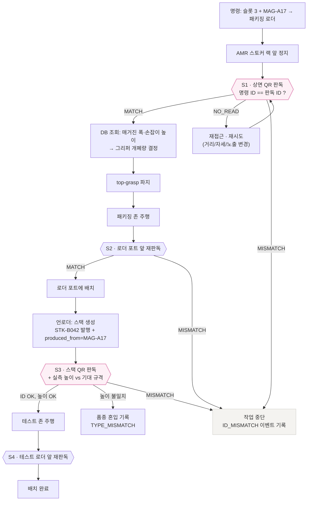

# 🔖 기능 확장 — QR/바코드 기반 캐리어 추적 구현 설계

> Isaac Sim_협동3 / 24.04+5.x / Development Process
> **상위 문서: [04_Backend_Carrier_Research.md](04_Backend_Carrier_Research.md) §12-1 「바코드/QR 기반 캐리어 추적」**
> 관련: [용어정리.md](용어정리.md) · [03_Backend_Carrier_Flow.html](03_Backend_Carrier_Flow.html)

---

## 이 문서의 위치

`04_Backend_Carrier_Research.md` §12-1이 **"왜 하는가"와 설계 원칙 네 가지**를 정했다.
이 문서는 그 결정을 **그대로 전제로 받아** 실제로 만들 수 있는 수준까지 내린 구현 설계다.

| §12-1이 정한 원칙 | 이 문서가 답하는 것 |
|---|---|
| QR에는 **ID만** 넣는다 | 정확히 몇 글자로? → 페이로드 포맷, QR 버전·ECC 확정 (2-1) |
| **탐색용이 아니라 검증용** | 대조 실패 시 무엇을 하는가 → 인터록 상태 기계 (2-7, 2-11) |
| QR은 **매거진 상면에** | 몇 mm 라벨을? USD에 어떻게 붙이나 → 부착 스크립트 + 크기 계산 (2-3, 2-4) |
| **정지 상태에서만** 근접 판독 | 몇 cm까지 접근해야 읽히나 → 수식 + 실측 (2-4) |
| 판독 불안정하면 **ArUco 대체** | 언제 그 판단을 내리나 → 폴백 기준 (2-4, 5장) |
| `carrier` / `event` **2테이블, SQLite** | 실제 DDL과 집계 질의 (2-8, 2-10) |
| 계보: 스택 `produced_from` | 언로더에서 ID를 어떻게 발행하나 (2-7, 2-8) |
| **하지 말 것**: MES 연동·실시간 대시보드 | 범위에서 제외함을 명시 (4장) |

> ⚠️ **§12-1과 충돌하는 내용은 이 문서에 없다.** 충돌이 생기면 §12-1이 우선이다.

### 한 줄 요약

> 매거진 상면과 트레이 스택에 **캐리어 ID만 담은 QR**을 붙이고,
> AMR이 정지한 상태에서 손목 카메라로 판독해 **명령이 지정한 ID와 대조**한다.
> 일치해야 파지하고, 일치해야 배치한다. 모든 시도는 성공·실패·사유와 함께 이벤트로 남는다.
>
> **이것은 로깅 기능이 아니라 인터록이다.**

---
---

# 1. 필요성

> §12-1의 "왜 필요한가"를 발표에서 쓸 수 있는 근거 수준까지 보강한 것이다.

## 1-1. 추적성은 "있으면 좋은 기능"이 아니라 납품 조건이다

| 영역 | 무엇을 강제하는가 | 우리 프로젝트와의 접점 |
|---|---|---|
| **반도체 (SEMI 표준)** | `SEMI E87`(Carrier Management)은 캐리어 단위 관리와 **로드포트에서의 캐리어 ID 확인**을, `SEMI E90`(Substrate Tracking)은 기판이 어느 위치에 있는지의 **상태 추적**을 정의한다. `SEMI E99`는 캐리어 ID 리더/라이터 인터페이스를, `SEMI E88`은 스토커(AMHS 보관) 서비스를 다룬다 | 우리가 만드는 것이 정확히 **스토커 ↔ 장비 포트 사이의 캐리어 이송**이다. 이 확장은 새 발명이 아니라 **업계 표준 모델의 축소 구현**이다. 고객사 MES에 붙일 때 말이 통한다 |
| **자동차 (IATF 16949)** | 부품 단위 추적성과 리콜 영향 범위 식별을 요구 | 같은 구조가 전장·모듈 라인에 그대로 적용 → 확장 시장 논거 |
| **의료기기 (FDA UDI / EU MDR)** | 라벨에 **기계 판독 가능한(AIDC) 식별자**를 요구 | 심볼 판독이 규제의 기본 전제임을 보여주는 사례 |
| **EU 배터리 규정 (EU) 2023/1542** | 배터리 여권을 **QR코드**로 연결하도록 요구 (2027-02-18 적용) | 규제가 **"QR코드"를 직접 지목**한 사례 |
| **EU ESPR (EU) 2024/1781** | 디지털 제품 여권(DPP) 프레임워크, 품목군별 확대 중 | 추적성 요구가 산업 전반으로 넓어지는 방향 |
| **ISA-95 / IEC 62264, MESA-11** | MES 기능 모델에 **Product Tracking & Genealogy**가 명시적으로 포함 | 우리 DB가 MES의 어느 기능인지 설명할 수 있다 |

`04` 문서 8장이 이미 현업 근거를 갖고 있다 — 로트 바코드로 **트랙 인/아웃**을 수행하는 것이 표준이고 [59],
후공정 MES가 트레이·매거진 자재 타입을 관리하며 [60], 국내에 **매거진 QR ↔ AMR 시스템 매칭** 사례가 있다 [53].
위 표는 그 위에 **"왜 업계 전체가 그렇게 하는가"** 를 얹은 것이다.

> 💡 **발표에서 가장 센 문장**
> 무인화의 전제 조건이 **캐리어 ID 자동 확인**이다.
> 사람이 없어지면 "라벨을 눈으로 보고 맞는 장비에 넣던" 판단 주체도 같이 사라지기 때문이다.
> **무인화는 자동 식별 없이는 성립하지 않는다.**

---

## 1-2. 추적성이 없을 때 치르는 비용 — "격리 범위"의 문제

불량이 발견됐을 때 진짜 비용은 불량품 자체가 아니라 **"어디까지 의심해야 하는가"** 에서 나온다.

| 추적 단위 | 불량 1건 발견 시 격리·재검사 범위 | 원인 규명 |
|---|---|---|
| 추적 없음 | 해당 기간 생산분 **전량** | 불가능 (추정만) |
| 일자 단위 | 그날 생산분 전체 | 매우 어려움 |
| 로트 단위 | 해당 로트 전체 | 가능 (로트 공통 원인까지) |
| **캐리어 + 시각 단위 (본 확장)** | 해당 캐리어, 그리고 **같은 포트를 같은 시간대에 거쳐 간 캐리어만** | 가능 (장비·시간·경로별 교차 분석) |

**"불량을 없애는 기능"이 아니라 "불량이 났을 때 손실 범위를 좁히는 기능"** 이라는 점이 설득의 핵심이다.
불량률 0%는 약속할 수 없지만, **격리 범위 축소는 구조적으로 보장**된다.

---

## 1-3. 형상 인식만으로는 개체 식별이 불가능하다

`04` 문서 10-6이 정한 픽업존은 **매거진을 선반 슬롯에 나란히** 놓는 구조다.
폭이 다른 매거진 3종이 섞여 있으므로 형상 인식으로 **종류**는 구분된다. 하지만 —

| 질문 | 형상·깊이 인식 | QR 판독 |
|---|---|---|
| "이게 매거진 A형인가 C형인가?" (폭 판별) | ✅ 가능 | ✅ 가능 |
| "이게 **A17번** 매거진인가 A18번인가?" | ❌ **불가능** (같은 종류면 외형 동일) | ✅ 가능 |
| "이 캐리어는 **어느 로트**인가?" | ❌ 불가능 | ✅ (ID → DB 조회) |
| "이 스택은 **어느 매거진에서** 나왔나?" | ❌ 불가능 | ✅ (`produced_from`) |

같은 종류 매거진이 여러 슬롯에 꽂혀 있으면 **개체(instance) 식별은 심볼 아니면 답이 없다.**
그리고 §12-1의 "탐색용이 아니라 검증용" 원칙이 겨냥하는 상황 —
**재고 정보와 실물이 다른 경우**(사람이 엉뚱한 슬롯에 꽂아 둠) — 은 형상 인식으로는 원리적으로 잡히지 않는다.
슬롯 3번에 있는 매거진이 A형이라는 것까지는 보이지만, 그게 **명령이 지정한 그 개체인지**는 알 수 없기 때문이다.

---

## 1-4. 왜 QR인가 — 대안 비교

| 방식 | 장점 | 단점 | 판단 |
|---|---|---|---|
| **1D 바코드 (Code 128)** | 가장 싸고 사람도 읽을 수 있다 | 같은 정보에 **가로로 길어져** 근접 시 화각을 벗어남. 오염·긁힘에 약함 | ⭕ 보조 (사람 확인용) |
| **QR (ISO/IEC 18004)** | 정사각형 고밀도, **회전 무관** 판독, ECC L/M/Q/H = 약 7/15/25/30% 복구 | 금속 직접 각인에는 Data Matrix가 우세 | ✅ **주력** (§12-1 결정) |
| **Data Matrix (ISO/IEC 16022)** | 반도체·전자 업계 사실상 표준, 더 작게 만들어도 판독 | 생성 라이브러리가 QR보다 적음 | ⭕ 실물 전개 시 1순위 대안 (**구조 동일, 심볼만 교체**) |
| **ArUco / AprilTag** | 아주 적은 픽셀로 검출, **6-DoF 자세 추정** | 담을 수 있는 건 ID 번호 하나 | ✅ **폴백 + 병행** (§12-1이 지정한 대체안) |
| **RFID** | 가림·오염에 강함, 쓰기 가능 | 태그 단가, **금속 간섭**, 리더 인프라, 위치 특정 어려움 | ❌ 범위 밖 (스키마는 동일 → 리더만 추가 가능) |
| **OCR** | 기존 라벨 그대로 | 오판독률 높고 체크섬 없음 | ❌ |

> 📌 실물 라인에서 웨이퍼 FOUP는 RFID를 많이 쓰지만,
> **후공정의 트레이·매거진은 소모성이고 수량이 많아 인쇄 라벨(1D/2D)이 지배적**이다.
> `04` 문서가 다루는 대상이 정확히 후자다.

---

## 1-5. 시뮬레이션에서 하는 것의 가치 — 그리고 정직한 한계

### 시뮬에서 진짜로 검증되는 것

1. **카메라 스펙 결정** — 실물 카메라를 사기 전에 라벨 크기·해상도·접근 거리를 확정할 수 있다 (2-4)
2. **스캔 시점 설계** — 파지 전인가 후인가에 따라 실패 복구 비용이 완전히 달라진다
3. **인터록 로직 전체** — 코드는 실물과 100% 동일하다
4. **DB 스키마와 집계 질의** — 계보 질의가 실제로 답을 주는지
5. **실패 시나리오 반복** — 미판독 재시도를 수백 번 안전하게

### 정직한 한계 — 반드시 문서에 남길 것

> ⚠️ **시뮬에서 렌더링된 QR은 실물보다 읽기 쉽다.**
> 초점이 완벽하고, 모션 블러가 없고, 라벨이 구겨지거나 더럽지 않다.
> 그대로 실험하면 **판독률 100%가 나오고, 그 숫자는 아무 의미가 없다.**

2-4절의 실측이 이것을 수치로 보여준다 — **열화가 없으면 2.0 px/모듈에서도 100%가 나오지만,
현실적 열화를 넣으면 3.0~3.5 px/모듈이 필요하다.** 1.5~1.75배 낙관적으로 나오는 셈이다.
따라서 도메인 랜덤화(2-12)는 선택이 아니라 필수다.
이 한계를 먼저 인정하고 대책을 제시하는 것이 발표에서 오히려 신뢰를 높인다.

---

## 1-6. 발표용 한 문장

> "기본 설계에서 로봇은 물건을 옮기기만 합니다. 오배송을 막는 장치가 없습니다.
> QR을 붙이고 명령의 ID와 대조하면, **일치하지 않을 때 파지도 배치도 하지 않습니다.**
> 그 판단 하나하나가 시각·위치·사유와 함께 남아서,
> 불량이 났을 때 **같은 시간에 같은 포트를 지나간 캐리어만 정확히 격리**할 수 있습니다.
> 그리고 완제품 스택에서 **원래 매거진과 로트까지 거슬러 올라갈 수 있습니다.**"

---
---

# 2. 구현 방법

## 2-0. 전체 구조

```mermaid
flowchart LR
    subgraph OFF["① 오프라인 (사전 준비)"]
        A1["캐리어 ID 체계"]
        A2["라벨 PNG 생성<br/>qrcode + python-barcode"]
        A3["USD 상면에 디칼 부착<br/>UsdShade + OmniPBR"]
        A1 --> A2 --> A3
    end

    subgraph SIM["② Isaac Sim 5.x"]
        B1["매거진 / 트레이 스택<br/>+ 상면 QR"]
        B2["손목 RealSense<br/>(정지 상태 근접)"]
        B3["OmniGraph<br/>ROS2CameraHelper"]
        B1 --> B2 --> B3
    end

    subgraph VIS["③ cobot3_perception"]
        C1["carrier_code_reader_node<br/>ROI → 전처리 → 디코드"]
        C2["스키마·체크문자 검증<br/>+ N-of-M 다수결"]
        C1 --> C2
    end

    subgraph ORC["④ cobot3_orchestrator"]
        D1["VerifyCarrier 서비스<br/>★ 명령 ID와 대조"]
        D2["event_logger_node"]
        D3[("SQLite<br/>carrier / event")]
        D1 --> D2 --> D3
    end

    A3 -.USD.-> B1
    B3 --"/wrist_cam/color/image_raw"--> C1
    C2 --"/perception/carrier_scan"--> D1
    D1 --"파지·배치 허가 / 중단"--> B1
    D3 --"실행 후 SQL·pandas 집계"--> R["실패 사유별 리포트"]

    style D1 fill:#fdf0f6,stroke:#e59ac0,stroke-width:2px
    style C1 fill:#f0edfa,stroke:#b7a9e8
    style D3 fill:#f4f3f0,stroke:#cfcdc8
```



---

## 2-1. Step 1 — 캐리어 ID 체계

§12-1: **"QR에는 ID만 넣는다. 공장·라인·로트 정보는 DB가 갖는다."**
이 원칙이 **판독 거리에 직접 이득**이라는 것을 수치로 확인했다.

### 페이로드 길이 → QR 버전 → 판독 거리 (실측)

| 담는 내용 | 예시 | 길이 | QR 버전 | 실효 모듈 | 50 mm 라벨 판독 거리<br/>(4 px/모듈, fx=640) |
|---|---|---|---|---|---|
| **ID만 (채택)** | `C3.MAG.A17.9` | 12자 | **V1 (21×21)** | **29** | **0.276 m** |
| 로트·날짜까지 | `C3.P2.L3.MAG.A17.240915.07.G` | 28자 | V2 (25×25) | 33 | 0.242 m |
| 자연어로 다 담기 | `PLANT=HS2;LINE=PKG3;LOT=...` | 54자 | V5 (37×37) | 45 | 0.178 m |

> **ID만 담으면 같은 라벨 크기에서 판독 거리가 13.8% 늘어난다** (V1 29모듈 vs V2 33모듈).
> 자연어로 다 담으면 **35% 줄어든다.**
> §12-1의 원칙이 "실제 MES가 그렇게 하니까"를 넘어 **물리적으로도 이득**임이 확인된다.

### 페이로드 포맷

```
C3 . MAG . A17 . 9
│    │     │     └─ 체크문자 (mod-36, 1자) — 오판독 방어
│    │     └─────── 캐리어 일련번호 (3~4자)
│    └───────────── 캐리어 타입  MAG(매거진) / STK(트레이 스택)
└────────────────── 스키마 태그 = 이 프로젝트의 심볼임을 표시 (2자)

매거진 : C3.MAG.A17.9      (12자)
스택   : C3.STK.B042.1     (13자)

→ QR 영숫자 모드 · Version 1 (21×21) · ECC Level Q(25% 복구)
→ quiet zone 4모듈 포함 실효 29모듈
```

**공장·라인·로트·규격은 전부 `carrier` 테이블에 있다.** 심볼은 그 행을 찾는 **키**일 뿐이다.

### 두 가지 함정

> 🔧 **① 구분자로 `.` 와 `-` 만 쓸 것**
> QR 영숫자 모드가 지원하는 문자는 `0-9 A-Z(대문자) 공백 $ % * + - . / :` 뿐이다.
> `|` 나 소문자를 쓰면 **바이트 모드로 떨어져 용량이 약 1.6배** 늘고, 버전이 올라가 판독 거리가 줄어든다.

> 🔧 **② V1에서는 ECC-H를 쓸 수 없다**
> `C3.MAG.A17.9`(12자)를 V1+ECC-H로 만들면 `DataOverflowError`가 난다 (V1-H 영숫자 용량 10자).
> **V1은 ECC-Q(25%)가 상한**이다. H(30%)가 꼭 필요하면 V2로 올려야 하고,
> 그러면 실효 모듈이 29→33이 되어 판독 거리가 12% 줄어든다.
> **클린룸 가정이므로 Q로 충분하다고 판단한다.**

---

## 2-2. Step 2 — 라벨 이미지 생성

```bash
pip install qrcode[pil] python-barcode pillow
```

`tools/gen_carrier_labels.py` (신규):

```python
"""캐리어 ID → 라벨 PNG (QR + Code128 + 사람이 읽는 텍스트)."""
import qrcode
from qrcode.constants import ERROR_CORRECT_Q
from barcode import Code128
from barcode.writer import ImageWriter
from PIL import Image, ImageDraw, ImageFont

MODULE_PX = 16          # 모듈 1개당 픽셀 — 작게 만든 뒤 확대하지 않는다
QUIET_MODULES = 4       # ISO/IEC 18004 요구 여백
TABLE = "0123456789ABCDEFGHIJKLMNOPQRSTUVWXYZ"


def mod36_check(s: str) -> str:
    """오판독을 애플리케이션 레벨에서 한 번 더 거르는 체크문자."""
    return TABLE[sum(TABLE.index(c) for c in s if c in TABLE) % 36]


def build_payload(ctype: str, serial: str) -> str:
    """ctype: MAG(매거진) | STK(트레이 스택)"""
    body = f"C3.{ctype}.{serial}"
    return f"{body}.{mod36_check(body)}"


def make_qr(payload: str) -> Image.Image:
    qr = qrcode.QRCode(
        version=1,                      # 21x21 고정 — 길어져 버전이 튀면 즉시 알 수 있다
        error_correction=ERROR_CORRECT_Q,
        box_size=MODULE_PX,
        border=QUIET_MODULES,
    )
    qr.add_data(payload)
    qr.make(fit=False)                  # 자동 버전 상향 금지 (크기 예측 가능성 유지)
    return qr.make_image(fill_color="black", back_color="white").convert("RGB")


def make_label(ctype: str, serial: str, out_path: str):
    payload = build_payload(ctype, serial)
    carrier_id = f"{ctype}-{serial}"
    qr_img = make_qr(payload)
    w = qr_img.width

    label = Image.new("RGB", (w, w + 180), "white")
    label.paste(qr_img, (0, 0))

    # 사람·핸디스캐너 확인용 1D 바코드
    bc = Code128(carrier_id, writer=ImageWriter()).render(
        {"module_height": 8.0, "font_size": 0, "quiet_zone": 2.0}
    )
    label.paste(bc.resize((w, 110), Image.NEAREST), (0, w + 10))

    draw = ImageDraw.Draw(label)
    draw.text((8, w + 128), carrier_id, fill="black",
              font=ImageFont.load_default(size=40))

    label.save(out_path)                # PNG 필수 — JPEG 압축은 모듈 경계를 뭉갠다
    print(f"{out_path}  payload={payload}  {len(payload)}자")


if __name__ == "__main__":
    for i in range(1, 21):                                  # 매거진 20개
        make_label("MAG", f"A{i:02d}", f"assets/labels/MAG-A{i:02d}.png")
    for i in range(1, 41):                                  # 스택 40개
        make_label("STK", f"B{i:03d}", f"assets/labels/STK-B{i:03d}.png")
```

> ⚠️ **PNG로 저장할 것.** JPEG 블록 압축은 QR 모듈 경계를 뭉갠다.
> **작게 만든 뒤 확대하지 말 것.** 보간 때문에 모듈이 흐려진다.

---

## 2-3. Step 3 — Isaac Sim USD에 부착

### §12-1 결정: **매거진 상면**

> "옆면이면 정면에서 읽고 다시 위로 올라가 손잡이를 잡아야 해서 자세를 두 번 잡는다.
> 상면이면 손목 카메라가 내려다보는 **한 번의 자세에서 판독과 파지점 산출이 같이 끝난다**"

`04` 문서 10-4의 파지 방식(**상부 핸들 top-grasp**)과도 정확히 맞는다.
손목 카메라가 위에서 내려다보는 자세가 곧 파지 접근 자세이므로 **스캔 전용 동작이 0개**다.

```
/World/PickupZone/Rack/Slot_03/Magazine_A17     ← 매거진 (RigidBody)
└── /Label                                       ← Xform (상면, 손잡이 옆)
    └── /Label/Quad                              ← UsdGeom.Mesh (4정점 + st primvar)
        └── binding → /World/Looks/QR_MAG_A17    ← UsdShade.Material (OmniPBR)
```

`tools/attach_label_to_usd.py` (신규):

```python
"""캐리어 상면에 QR 라벨 디칼(쿼드 + OmniPBR)을 부착한다."""
from pxr import Usd, UsdGeom, UsdShade, Sdf, Gf

LABEL_W = 0.050          # 라벨 한 변 [m] — 2-4절 계산으로 결정
SURFACE_OFFSET = 0.0008  # 0.8 mm 띄움 — z-fighting 방지 (필수)


def create_label_material(stage, mat_path: str, texture_path: str):
    material = UsdShade.Material.Define(stage, mat_path)
    shader = UsdShade.Shader.Define(stage, f"{mat_path}/Shader")
    shader.CreateIdAttr("OmniPBR")
    shader.SetSourceAsset(Sdf.AssetPath("OmniPBR.mdl"), "mdl")
    shader.SetSourceAssetSubIdentifier("OmniPBR", "mdl")

    shader.CreateInput("diffuse_texture", Sdf.ValueTypeNames.Asset).Set(
        Sdf.AssetPath(texture_path))
    # ↓ 판독 성패를 가르는 3줄 — 무광 종이 라벨을 흉내낸다
    shader.CreateInput("reflection_roughness_constant",
                       Sdf.ValueTypeNames.Float).Set(0.9)
    shader.CreateInput("metallic_constant", Sdf.ValueTypeNames.Float).Set(0.0)
    shader.CreateInput("specular_level", Sdf.ValueTypeNames.Float).Set(0.1)

    material.CreateSurfaceOutput("mdl").ConnectToSource(
        shader.ConnectableAPI(), "out")
    return material


def create_label_quad(stage, quad_path: str, w: float):
    mesh = UsdGeom.Mesh.Define(stage, quad_path)
    h = w / 2.0
    mesh.CreatePointsAttr([(-h, -h, 0), (h, -h, 0), (h, h, 0), (-h, h, 0)])
    mesh.CreateFaceVertexCountsAttr([4])
    mesh.CreateFaceVertexIndicesAttr([0, 1, 2, 3])
    mesh.CreateNormalsAttr([(0, 0, 1)] * 4)
    mesh.CreateDoubleSidedAttr(False)

    # UV(st) primvar — 없으면 텍스처가 아예 보이지 않는다
    st = UsdGeom.PrimvarsAPI(mesh).CreatePrimvar(
        "st", Sdf.ValueTypeNames.TexCoord2fArray, UsdGeom.Tokens.varying)
    st.Set([(0, 0), (1, 0), (1, 1), (0, 1)])
    return mesh


def attach_top_label(stage, carrier_path: str, texture_path: str, carrier_id: str,
                     top_z: float, offset_xy=(0.0, 0.05)):
    """상면(+Z)에 라벨을 눕혀 붙인다. 손목 카메라가 내려다보는 방향과 법선이 일치."""
    label = UsdGeom.Xform.Define(stage, f"{carrier_path}/Label")
    UsdGeom.Xformable(label).AddTranslateOp().Set(
        Gf.Vec3d(offset_xy[0], offset_xy[1], top_z + SURFACE_OFFSET))
    # 회전 없음: 쿼드의 법선 +Z 가 이미 위를 향한다

    quad = create_label_quad(stage, f"{carrier_path}/Label/Quad", LABEL_W)
    mat = create_label_material(stage, f"/World/Looks/QR_{carrier_id}", texture_path)
    UsdShade.MaterialBindingAPI(quad.GetPrim()).Bind(mat)

    # 디칼은 물리에 참여하지 않는다
    quad.GetPrim().CreateAttribute(
        "physics:collisionEnabled", Sdf.ValueTypeNames.Bool).Set(False)
    return quad
```

### 부착 체크리스트 — 안 지키면 반드시 문제가 생긴다

| 항목 | 이유 | 안 지켰을 때 증상 |
|---|---|---|
| **0.5~1 mm 표면 오프셋** | z-fighting 방지 | 라벨이 깜빡이거나 줄무늬로 찢어짐 → 판독 불가 |
| **`st` primvar 명시** | `Cube`/`Plane`은 기본 UV가 없을 수 있음 | 텍스처가 안 보이고 회색 면만 |
| **roughness 0.9 / metallic 0** | 정반사가 흰 모듈을 날려버림 | 조명 각도에 따라 **간헐적 미판독** — 재현이 어려워 디버깅 지옥 |
| **collision 비활성** | 디칼이 그리퍼와 충돌하면 안 됨 | 파지 실패율이 원인 불명으로 상승 |
| **캐리어의 자식으로 배치** | 캐리어가 움직일 때 라벨도 따라가야 | 라벨이 공중에 남음 |
| **손잡이와 겹치지 않는 위치** | top-grasp 시 그리퍼가 라벨을 가림 | 파지 직전 재판독이 불가능 |
| **텍스처 colorSpace = sRGB** | 감마가 틀어지면 대비 저하 | 저조도 실험에서 판독률 하락 |

> 🔧 **디버그 순서**: 전혀 안 읽히면 머티리얼을 임시로 **emissive(자체발광)** 로 바꿔 조명 영향을 0으로 만든다.
> 그때 읽히면 원인은 **조명/반사**, 여전히 안 읽히면 **해상도/UV/텍스처 경로**다.
> 최종 실험은 반드시 무광 diffuse로 되돌린다. emissive는 현실에 없다.

### 언로더에서 생성되는 스택에 ID 발행하기

§12-1의 계보 추적은 **"스택에도 고유 ID를 부여"** 를 요구한다.
실물에서는 언로더가 라벨을 인쇄해 붙이는 동작이고, 시뮬에서는 **스폰 시 텍스처를 바인딩**하면 된다.

```python
import omni.replicator.core as rep

def spawn_stack_with_label(stage, stack_prim_path, stack_serial, produced_from):
    """언로더가 스택을 내줄 때 = 실물의 라벨 프린터."""
    carrier_id = f"STK-{stack_serial}"
    attach_top_label(stage, stack_prim_path,
                     f"assets/labels/{carrier_id}.png", carrier_id,
                     top_z=stack_height(stack_prim_path))
    # DB 에 계보 한 줄 — 이 스택이 어느 매거진에서 나왔는가
    db.insert_carrier(carrier_id, ctype="tray_stack", produced_from=produced_from)
    return carrier_id
```

반복 시행마다 캐리어를 바꿀 때는 USD를 고치지 말고 **텍스처만 갈아 끼운다**:

```python
with rep.trigger.on_frame(interval=1):
    with rep.get.prims(path_pattern="/World/PickupZone/.*/Label/Quad"):
        rep.randomizer.texture(textures=MAGAZINE_LABEL_TEXTURES)
```

> 이때 **시뮬이 아는 정답(어느 prim에 어느 텍스처가 붙었는가)** 을 같이 로그로 남겨야
> 판독 결과와 대조해 **오판독(misread)** 을 셀 수 있다 (2-12절 실험의 정답 레이블).

---

## 2-4. Step 4 — 얼마나 가까이 가야 읽히는가

§12-1은 **"정지 상태에서 근접 판독"** 을 정했다. 그 "근접"이 몇 cm인지를 여기서 확정한다.

### 수식

```
카메라 초점거리(픽셀)   fx = (이미지_가로_px / 2) / tan(HFOV / 2)
모듈당 픽셀             px_per_module = fx × W_symbol / (Z × N_modules)
판독 조건               px_per_module ≥ 3 (최소) / ≥ 4 (권장)

∴ 최대 판독 거리        Z_max = fx × W_symbol / (k × N_modules)
```

- `N_modules` = 21(V1) + 4 + 4(quiet zone) = **29**
- `fx` 는 **시뮬이 퍼블리시하는 `camera_info`의 K[0]** 을 쓴다 (추측 금지)
- RealSense D455 컬러 기준 (HFOV ≈ 90°, 1280×720) → `fx ≈ 640`

### 라벨 크기별 최대 판독 거리 [m]

| 라벨 한 변 | 1280×720 (fx≈640)<br/>최소 3px | 1280×720<br/>**권장 4px** | 1920×1080 (fx≈960)<br/>최소 3px | 1920×1080<br/>**권장 4px** |
|---|---|---|---|---|
| 25 mm | 0.18 | 0.14 | 0.28 | 0.21 |
| 30 mm | 0.22 | 0.17 | 0.33 | 0.25 |
| **40 mm** | 0.29 | **0.22** | 0.44 | **0.33** |
| **50 mm (권장)** | 0.37 | **0.28** | 0.55 | **0.41** |
| 80 mm | 0.59 | 0.44 | 0.88 | 0.66 |

### ✅ 실측 검증 — "3 px/모듈"은 경험칙이 아니라 측정한 값이다

임계값 `k`를 실제로 측정했다. QR을 모듈당 픽셀 수를 낮춰가며 렌더링하고,
**실제 카메라가 만드는 열화**를 주입한 뒤 zxing-cpp로 디코딩했다.

주입한 열화: **서브픽셀 정렬 어긋남(±0.5 px)** — 실제 카메라는 절대 심볼과 픽셀 격자가 정렬되지 않는다 ·
**미소 회전(±8°)** · **가우시안 블러**(초점·모션) · **가우시안 노이즈**(저조도 센서).
페이로드 `C3.MAG.A17.9` (V1 · ECC-Q · 29모듈), 조건당 30회 시행.

| 조건 | 1.5 px | 2.0 px | 2.5 px | 3.0 px | 3.5 px | 4.0 px | **100% 임계** |
|---|---|---|---|---|---|---|---|
| 열화 없음 (= 이상적 시뮬) | 97 % | 100 % | 100 % | 100 % | 100 % | 100 % | **2.0** |
| 블러 σ=0.8 | 0 % | 100 % | 100 % | 100 % | 100 % | 100 % | **2.0** |
| 블러 σ=0.8 + 노이즈 σ=12 | 0 % | 0 % | 53 % | 100 % | 100 % | 100 % | **3.0** |
| 블러 σ=1.2 + 노이즈 σ=12 | 0 % | 0 % | 0 % | 50 % | 100 % | 100 % | **3.5** |

**이 측정이 말해 주는 것 3가지**

1. **`k=3`(최소) / `k=4`(권장) 기준이 실측으로 확인됐다.** 위 거리표를 그대로 설계에 쓸 수 있다.
2. **열화가 없으면 2.0 px에서도 100%가 나온다 — 1-5절에서 경고한 함정이 실제로 보인다.**
   깨끗한 시뮬 렌더링만으로 실험하면 **1.5~1.75배 낙관적인 결과**가 나온다.
3. **노이즈가 블러보다 치명적이다.** 블러만 있을 때는 2.0 px로 충분했지만 노이즈를 더하자 3.0 px가 필요해졌다.
   → **저조도 대응(조명 확보·노출 조정)이 초점 맞추기보다 우선순위가 높다.**

<details>
<summary>측정 재현 스크립트 (펼치기)</summary>

```python
"""모듈당 픽셀 수를 낮춰가며 판독 임계값을 측정한다."""
import cv2
import numpy as np
import qrcode
import zxingcpp
from qrcode.constants import ERROR_CORRECT_Q

PAYLOAD = "C3.MAG.A17.9"


def render_big():
    qr = qrcode.QRCode(version=1, error_correction=ERROR_CORRECT_Q,
                       box_size=40, border=4)
    qr.add_data(PAYLOAD)
    qr.make(fit=False)
    img = np.array(qr.make_image(fill_color="black",
                                 back_color="white").convert("L"))
    return img, len(qr.get_matrix())        # n = 29 (quiet zone 포함)


def sample(big, n, k, rng, blur_sigma, noise_sigma):
    """카메라처럼 임의의 서브픽셀 위상과 미소 회전으로 샘플링한다."""
    t = int(round(n * k))
    c = int(t * 1.6)
    out = np.full((c, c), 255, np.uint8)
    o = (c - t) // 2
    out[o:o + t, o:o + t] = cv2.resize(big, (t, t), interpolation=cv2.INTER_AREA)

    dx, dy = rng.uniform(-0.5, 0.5, 2)                       # 서브픽셀 어긋남
    M = cv2.getRotationMatrix2D((c / 2, c / 2), rng.uniform(-8, 8), 1.0)
    M[0, 2] += dx
    M[1, 2] += dy
    out = cv2.warpAffine(out, M, (c, c), flags=cv2.INTER_LINEAR,
                         borderMode=cv2.BORDER_CONSTANT, borderValue=255)

    if blur_sigma:
        out = cv2.GaussianBlur(out, (0, 0), blur_sigma)
    if noise_sigma:
        out = np.clip(out.astype(np.int16)
                      + rng.normal(0, noise_sigma, out.shape), 0, 255).astype(np.uint8)
    return out


def sweep(blur_sigma, noise_sigma, trials=30):
    rng = np.random.default_rng(42)
    big, n = render_big()
    for k in [1.5, 2.0, 2.5, 3.0, 3.5, 4.0]:
        hit = sum(
            any(h.text == PAYLOAD for h in zxingcpp.read_barcodes(
                sample(big, n, k, rng, blur_sigma, noise_sigma)))
            for _ in range(trials))
        print(f"  {k} px/module : {100 * hit / trials:5.1f} %")


if __name__ == "__main__":
    for bs, ns in [(0.0, 0), (0.8, 0), (0.8, 12), (1.2, 12)]:
        print(f"[블러 σ={bs}, 노이즈 σ={ns}]")
        sweep(bs, ns)
```

</details>

### 여기서 나오는 설계 결론 3가지

> **① 50 mm 라벨 + 1280×720 이면 0.28 m 까지 읽힌다 → top-grasp 접근 자세와 정확히 겹친다.**
> §12-1의 "정지 후 근접 판독"이 **별도 스캔 동작 없이** 성립한다. 사이클 타임 증가 ≈ 0.

> **② 원거리 고정 카메라로 QR을 읽는 것은 불가능하다.**
> 1.5 m에서 4 px/모듈을 만족하려면 라벨이 `1.5 × 4 × 29 / 640 ≈ 272 mm` 필요 → 비현실적.
> 랙 상단 고정 카메라는 **슬롯 점유 탐색 전용**으로 두고, QR 판독을 맡기지 않는다.

> **③ ArUco 폴백 기준이 정해진다.**
> ArUco `DICT_4X4_50`은 데이터 4×4 + 테두리 = **6모듈**뿐이라,
> 80 mm 마커의 이론 판독 거리가 `640 × 0.08 / (3 × 6) ≈ 2.8 m` (보수적으로 1.5 m). **QR 대비 약 5배.**
> **폴백 발동 조건**: 2-12절 도메인 랜덤화 실험에서 **pre-grasp 판독률이 95% 미만**이면
> 매거진 상면 심볼을 ArUco로 교체한다 (ID만 담으면 되므로 정보 손실이 없고, 자세 추정이 덤으로 나온다).

### Isaac Sim 카메라 설정

```python
# 실물 D455와 fx를 맞춘다 — 안 맞으면 위 거리표가 전부 무의미해진다
import math
from pxr import UsdGeom

cam = UsdGeom.Camera(stage.GetPrimAtPath("/World/.../wrist_cam"))
HFOV_DEG, IMG_W = 90.0, 1280
h_aperture = 20.955                                  # [mm] 관례값
f_mm = (h_aperture / 2.0) / math.tan(math.radians(HFOV_DEG / 2.0))

cam.GetFocalLengthAttr().Set(f_mm)
cam.GetHorizontalApertureAttr().Set(h_aperture)
# fx[px] = f_mm / h_aperture * IMG_W  → camera_info 의 K[0] 과 일치해야 한다
```

OmniGraph ROS 2 퍼블리시 (기존 `isaacpjt/M0609/lula_ik/7_pick_place_color2.py`의 `og.Controller.edit` 패턴과 동일):

```python
import omni.graph.core as og

og.Controller.edit(
    {"graph_path": "/World/ROS2_WristCam", "evaluator_name": "execution"},
    {
        og.Controller.Keys.CREATE_NODES: [
            ("OnTick",     "omni.graph.action.OnPlaybackTick"),
            ("Context",    "isaacsim.ros2.bridge.ROS2Context"),
            ("RenderProd", "isaacsim.core.nodes.IsaacCreateRenderProduct"),
            ("RGBPub",     "isaacsim.ros2.bridge.ROS2CameraHelper"),
            ("InfoPub",    "isaacsim.ros2.bridge.ROS2CameraInfoHelper"),
        ],
        og.Controller.Keys.SET_VALUES: [
            ("RenderProd.inputs:cameraPrim", "/World/.../wrist_cam"),
            ("RenderProd.inputs:width",  1280),     # ← 판독률 실험의 핵심 변수
            ("RenderProd.inputs:height",  720),
            ("RGBPub.inputs:type",       "rgb"),
            ("RGBPub.inputs:topicName",  "/wrist_cam/color/image_raw"),
            ("RGBPub.inputs:frameId",    "wrist_cam_color_optical_frame"),
            ("InfoPub.inputs:topicName", "/wrist_cam/color/camera_info"),
        ],
        og.Controller.Keys.CONNECT: [
            ("OnTick.outputs:tick",                  "RenderProd.inputs:execIn"),
            ("RenderProd.outputs:execOut",           "RGBPub.inputs:execIn"),
            ("RenderProd.outputs:renderProductPath", "RGBPub.inputs:renderProductPath"),
            ("RenderProd.outputs:renderProductPath", "InfoPub.inputs:renderProductPath"),
            ("Context.outputs:context",              "RGBPub.inputs:context"),
        ],
    },
)
```

> 📌 **기존 코드와의 정합성**: 현재 `src/m0609/m0609/m0609_color_detector.py`는 `/rgb` 를 구독한다.
> 새 토픽은 `/wrist_cam/color/image_raw` 로 정리하되 **기존 노드는 launch 파일 remap 으로 흡수**한다.
> 이 이름은 실물 `realsense2_camera` 드라이버 구조에 맞춘 것이라 **sim → real 전환 시 코드 수정이 0**이다.
> (드라이버 버전에 따라 `/camera/camera/...` 로 달라질 수 있으므로 remap 으로 처리)

---

## 2-5. Step 5 — 판독 노드

### 디코더 선정

| 라이브러리 | 지원 심볼 | 특징 | 판단 |
|---|---|---|---|
| **zxing-cpp** (`pip install zxing-cpp`) | QR, Data Matrix, Code128 등 | C++ 백엔드로 빠르고 robust. **Data Matrix 지원**이 실물 전환 시 결정적 | ✅ **주력** |
| **pyzbar** (`apt install libzbar0`) | QR, Code128 등 | 오래되고 안정적 | ⭕ 교차검증 폴백 |
| `cv2.QRCodeDetector` | QR만 | OpenCV 내장 | ⭕ 최소 스파이크용 |
| `cv2.wechat_qrcode_*` | QR만 | 작고 흐린 QR에 강함 (contrib 필요) | ⭕ 저조도 대비책 |

### `src/cobot3_perception/cobot3_perception/carrier_code_reader_node.py` (신규)

```python
"""
캐리어 라벨(QR/바코드) 판독 노드

입력 토픽:
    /wrist_cam/color/image_raw      sensor_msgs/Image
    /wrist_cam/color/camera_info    sensor_msgs/CameraInfo

출력 토픽:
    /perception/carrier_scan        cobot3_interfaces/CarrierScan
    /perception/carrier_scan_debug  sensor_msgs/Image
"""
import re
import time
from collections import Counter, deque

import cv2
import numpy as np
import rclpy
import zxingcpp
from cv_bridge import CvBridge
from rclpy.node import Node
from rclpy.qos import qos_profile_sensor_data
from sensor_msgs.msg import CameraInfo, Image

from cobot3_interfaces.msg import CarrierScan

TABLE = "0123456789ABCDEFGHIJKLMNOPQRSTUVWXYZ"
PAYLOAD_RE = re.compile(r"^C3\.(MAG|STK)\.([A-Z0-9]{3,4})\.([A-Z0-9])$")


def mod36_check(s: str) -> str:
    return TABLE[sum(TABLE.index(c) for c in s if c in TABLE) % 36]


def validate(payload: str):
    """스키마 + 체크문자 검증. 통과 못 하면 '못 읽은 것'으로 취급한다."""
    m = PAYLOAD_RE.match(payload)
    if not m:
        return None
    if mod36_check(payload.rsplit(".", 1)[0]) != m.group(3):
        return None
    ctype, serial, _ = m.groups()
    return {
        "carrier_id": f"{ctype}-{serial}",
        "carrier_type": "magazine" if ctype == "MAG" else "tray_stack",
    }


def preprocess(bgr):
    """디코드 후보 이미지들. 하나라도 성공하면 된다."""
    gray = cv2.cvtColor(bgr, cv2.COLOR_BGR2GRAY)
    yield gray                                              # 원본

    clahe = cv2.createCLAHE(clipLimit=2.5, tileGridSize=(8, 8))
    eq = clahe.apply(gray)
    yield eq                                                # 대비 보정 (저조도)

    blur = cv2.GaussianBlur(eq, (0, 0), 2.0)
    yield cv2.addWeighted(eq, 1.6, blur, -0.6, 0)           # 언샤프 (초점 흐림)

    yield cv2.adaptiveThreshold(                            # 국소 이진화 (하이라이트)
        eq, 255, cv2.ADAPTIVE_THRESH_GAUSSIAN_C, cv2.THRESH_BINARY, 31, 5)


class CarrierCodeReader(Node):

    def __init__(self):
        super().__init__("carrier_code_reader")
        self.declare_parameter("decode_hz", 5.0)      # 30Hz 전부 디코드할 필요 없다
        self.declare_parameter("roi_fraction", 0.6)   # 중앙 60% (속도 + 옆 슬롯 오검출 차단)
        self.declare_parameter("vote_window", 5)
        self.declare_parameter("vote_required", 3)

        self.bridge = CvBridge()
        self.K = None
        self.votes = deque(maxlen=int(self.get_parameter("vote_window").value))
        self.last_decode = 0.0

        self.pub = self.create_publisher(
            CarrierScan, "/perception/carrier_scan", 10)

        self.create_subscription(
            CameraInfo, "/wrist_cam/color/camera_info",
            lambda m: setattr(self, "K", np.array(m.k).reshape(3, 3)),
            qos_profile_sensor_data)
        self.create_subscription(
            Image, "/wrist_cam/color/image_raw",
            self.on_image, qos_profile_sensor_data)

        self.get_logger().info(
            "carrier_code_reader 시작: /wrist_cam → /perception/carrier_scan")

    def on_image(self, msg):
        # ---- 1) 레이트 제한 -------------------------------------------------
        period = 1.0 / float(self.get_parameter("decode_hz").value)
        now = time.monotonic()
        if now - self.last_decode < period:
            return
        self.last_decode = now

        bgr = self.bridge.imgmsg_to_cv2(msg, desired_encoding="bgr8")

        # ---- 2) ROI 크롭 ----------------------------------------------------
        h, w = bgr.shape[:2]
        f = float(self.get_parameter("roi_fraction").value)
        x0, y0 = int(w * (1 - f) / 2), int(h * (1 - f) / 2)
        roi = bgr[y0:y0 + int(h * f), x0:x0 + int(w * f)]

        # ---- 3) 디코드 (전처리 후보를 순서대로) -------------------------------
        t0 = time.perf_counter()
        result = None
        for cand in preprocess(roi):
            hits = zxingcpp.read_barcodes(cand)
            if hits:
                result = hits[0]
                break
        decode_ms = (time.perf_counter() - t0) * 1000.0

        if result is None:
            self.votes.append(None)
            return

        # ---- 4) 스키마·체크문자 검증 ----------------------------------------
        parsed = validate(result.text)
        if parsed is None:
            self.get_logger().warn(f"스키마 불일치 폐기: {result.text!r}")
            self.votes.append(None)
            return

        # ---- 5) N-of-M 다수결 — 단일 프레임으로 확정하지 않는다 ---------------
        self.votes.append(parsed["carrier_id"])
        counts = Counter(v for v in self.votes if v is not None)
        best_id, best_n = counts.most_common(1)[0]
        if best_n < int(self.get_parameter("vote_required").value):
            return
        if best_id != parsed["carrier_id"]:
            return

        # ---- 6) 심볼까지 거리 (판독률 분석용) --------------------------------
        range_m = self.estimate_range(result)

        # ---- 7) 퍼블리시 ------------------------------------------------------
        out = CarrierScan()
        out.header = msg.header
        out.raw_payload = result.text
        out.symbology = str(result.format)
        out.carrier_id = parsed["carrier_id"]
        out.carrier_type = parsed["carrier_type"]
        out.reader_id = "wrist_cam"
        out.payload_valid = True
        out.decode_latency_ms = float(decode_ms)
        out.frame_votes = int(best_n)
        out.range_m = float(range_m) if range_m else 0.0
        self.pub.publish(out)

    def estimate_range(self, result):
        """심볼의 화면상 크기로 거리를 역산한다 (Z = fx * W / px)."""
        if self.K is None:
            return None
        xs = [p.x for p in result.position]
        ys = [p.y for p in result.position]
        px = max(max(xs) - min(xs), max(ys) - min(ys))
        if px <= 0:
            return None
        LABEL_W = 0.050                          # 라벨 실제 한 변 [m]
        return self.K[0, 0] * LABEL_W / px


def main(args=None):
    rclpy.init(args=args)
    node = CarrierCodeReader()
    try:
        rclpy.spin(node)
    except KeyboardInterrupt:
        pass
    finally:
        node.destroy_node()
        rclpy.shutdown()


if __name__ == "__main__":
    main()
```

### 설계 의도 (코드보다 중요한 부분)

| 장치 | 왜 넣었는가 |
|---|---|
| **레이트 제한 (5 Hz)** | 30 Hz 전부 디코드할 이유가 없다. 다른 인식 작업과 CPU를 다투지 않게 한다 |
| **ROI 크롭 (중앙 60%)** | 속도 + **옆 슬롯 매거진의 라벨을 잘못 읽는 것을 물리적으로 차단**. 선반 슬롯 병렬 배치(10-6)에서 특히 중요하다 |
| **전처리 후보 4종** | 저조도·하이라이트·초점 흐림 중 무엇이 문제인지 몰라도 하나는 걸린다 |
| **스키마 정규식 + 체크문자** | 다른 심볼(장비 자산 태그 등)을 캐리어로 오인하지 않는다 |
| **N-of-M 다수결** | **단일 프레임 오판독을 구조적으로 제거** |
| **거리 역산** | 판독률을 거리 구간별로 집계하기 위한 값 (2-12) |

> ⚠️ **미판독(no-read)과 오판독(misread)은 완전히 다른 사건이다.**
> - **미판독**: 못 읽음 → **안전하다.** 재시도하면 된다 → 작업 지연
> - **오판독**: 다른 ID로 잘못 읽음 → **위험하다.** 틀린 이력이 DB에 남아 추적성 자체를 오염시킨다 → 로트 손실
>
> QR의 Reed–Solomon 오류정정이 이미 오판독을 강하게 억제하지만,
> 그 위에 **① 스키마 정규식 ② 체크문자 ③ N-of-M 다수결** 3중 방어를 얹는다.
> **목표는 미판독 허용 / 오판독 0건.**

---

## 2-6. Step 6 — 인터페이스 정의 (`cobot3_interfaces`)

현재 `src/cobot3_interfaces/` 의 msg/srv/action 파일은 **전부 빈 스켈레톤**이다.
이 확장에서 아래 3개를 추가한다.

### `msg/CarrierScan.msg` (신규)

```
# 캐리어 라벨 1회 판독 결과
std_msgs/Header header              # stamp = 프레임 취득 시각

string raw_payload                  # 디코딩된 원문 (검증 실패해도 원문은 남긴다)
string symbology                    # QRCode | DataMatrix | Code128 | ArUco
bool   payload_valid                # 스키마 + 체크문자 통과 여부

string carrier_id                   # MAG-A17 | STK-B042
string carrier_type                 # magazine | tray_stack

string reader_id                    # wrist_cam
float32 range_m                     # 심볼까지 거리 (판독률 분석용)
float32 decode_latency_ms
uint8   frame_votes                 # 다수결에 참여해 같은 결론을 낸 프레임 수
```

> 📌 `lot_id` / `plant_id` 같은 필드는 **일부러 넣지 않았다.**
> §12-1 원칙대로 심볼은 ID만 담으므로, 판독 노드가 알 수 있는 것도 ID까지다.
> 로트·공장·라인은 오케스트레이터가 `carrier` 테이블에서 조회한다.

### `srv/VerifyCarrier.srv` (신규) — **★ 인터록의 핵심**

```
string  expected_carrier_id         # 명령이 지정한 캐리어 (§12-1: 슬롯 + ID)
string  scan_point                  # 어느 지점의 확인인가
float32 timeout_sec                 # 이 시간 안에 판독되지 않으면 TIMEOUT
---
bool    ok                          # true 일 때만 파지/배치를 진행한다
uint8   result                      # 0=MATCH 1=MISMATCH 2=NO_READ 3=TIMEOUT
string  actual_carrier_id
string  message
```

### `msg/TraceEvent.msg` (신규) — `event` 테이블 1행과 1:1 대응

```
std_msgs/Header header
string  carrier_id
string  amr_id
string  event_type                  # PICK_TRY | PICK_OK | TRANSIT | PLACE_TRY | PLACE_OK
                                    # | NO_READ | ID_MISMATCH | TYPE_MISMATCH
string  zone                        # STOCKER | PACKAGING | TEST
string  port                        # 슬롯 번호 또는 포트 번호
string  stage                       # 인식 | 검증 | 파지 | 주행 | 배치   (실패 사유 분류용)
string  fail_reason                 # 실패 시에만
bool    success
float64 sim_time                    # 시뮬 시각 (use_sim_time)
builtin_interfaces/Time wall_time   # 벽시계 시각
string  run_id                      # 반복 시행 회차
```

> 🔧 **`sim_time`과 `wall_time`을 둘 다 저장하는 이유**
> Isaac Sim을 `use_sim_time=true` 로 돌리면 시뮬 시계를 쓴다. 빨리 감거나 일시정지하면 둘이 어긋난다.
> - 사이클 타임 분석 → `sim_time` (물리적으로 옳음)
> - "몇 시에 배달됐는가" → `wall_time`
>
> 하나만 저장하면 반드시 나중에 후회한다.

`CMakeLists.txt`에 추가:

```cmake
  "msg/CarrierScan.msg"
  "msg/TraceEvent.msg"
  "srv/VerifyCarrier.srv"
```

---

## 2-7. Step 7 — 스캔을 사이클 어디에 넣는가

`04` 문서 10-3의 두 이송 구간에 스캔 **4지점**을 넣는다.

| 스캔 | 위치 | 대조 대상 | 실패 시 |
|---|---|---|---|
| **S1** | **스토커 슬롯 앞, 파지 직전** | 명령이 지정한 매거진 ID | **파지하지 않음** ← §12-1 6번 항목 |
| **S2** | **패키징 로더 포트, 배치 직전** | 명령의 매거진 ID + 포트 | 배치하지 않음 |
| **S3** | **패키징 언로더, 스택 파지 직전** | 언로더가 발행한 스택 ID | 파지하지 않음 |
| **S4** | **테스트 로더 포트, 배치 직전** | 명령의 스택 ID + 포트 | 배치하지 않음 |



### 세 가지 설계 포인트

> **① S1은 반드시 파지 "전"이다.**
> 파지 전이면 잘못된 매거진을 집는 일 자체가 발생하지 않는다.
> 파지 후면 이미 집은 것을 되돌려 놓는 복구 동작이 필요하고, 그 동안 낙하 위험에 노출된다.
> **"확인하고 집는다"와 "집고 확인한다"는 사이클 타임은 같지만 리스크가 다르다.**

> **② S1의 판독 결과가 곧 그리퍼 개폐량 조회 키다.**
> §12-1: *"일치하면 DB에서 규격(폭, 손잡이 높이)을 조회해 그리퍼를 벌리고 파지한다."*
> 매거진 3종은 **폭이 변하는 캐리어**(10-4)이므로, ID를 모르면 얼마나 벌려야 하는지도 모른다.
> **QR 판독은 오배송 방지인 동시에 파지 파라미터 조회 경로다.** 두 기능이 한 동작에 들어 있다.
> 여기에 §12-1의 제안대로 **"DB 예상 폭 vs 깊이 영상 실측 폭"의 차이를 로그로 남기면**
> DB 조회 방식과 비전 추정 방식을 사후에 비교할 수 있다.

> **③ S3이 품종 혼입 감지 지점이다.**
> `04` 문서 10-4: 매거진 → 스택 매핑은 **정답이 아니라 기대값**이다.
> S3에서 스택 ID를 읽어 `produced_from`으로 원래 매거진을 찾고,
> 그 매거진이 낳아야 할 스택 높이(기대값)와 **깊이 영상 실측 높이**를 비교한다.
> 다르면 `TYPE_MISMATCH` — 이것이 **품종 혼입 감지**다. 깊이 한 번 재는 비용밖에 안 든다.

### 캐리어 상태 모델 (SEMI E90 개념 차용)

```
IN_STOCKER ──S1 MATCH──▶ VERIFIED ──파지──▶ ON_AMR ──S2 MATCH──▶ AT_LOADER
                                                                     │
                                                       (패키징 존 내부 처리)
                                                                     ▼
STACK_CREATED ──S3 MATCH──▶ ON_AMR ──S4 MATCH──▶ AT_TEST_LOADER ──▶ 완료
     │
     └─ produced_from = 투입된 매거진 ID   ← 계보의 연결 고리
```

모든 상태 전이가 `event` 테이블 한 행이다.
§12-1의 *"명령 큐에 이미 상태 기계가 있으므로 상태 전이마다 한 줄씩 쓰면 끝난다"* 가 이 구조다.

---

## 2-8. Step 8 — DB

§12-1: **"테이블 두 개면 충분하다. SQLite로 족하다."** 그대로 따른다.

### `sql/schema.sql` (신규)

```sql
-- ============================================================
-- carrier : 캐리어 마스터 (매거진 + 트레이 스택 공용)
-- ============================================================
CREATE TABLE IF NOT EXISTS carrier (
    carrier_id     TEXT PRIMARY KEY,        -- MAG-A17 | STK-B042
    carrier_type   TEXT NOT NULL            -- magazine | tray_stack
                   CHECK (carrier_type IN ('magazine', 'tray_stack')),

    -- 규격을 JSON 한 칸에 담는다 (§12-1: 두 캐리어의 변형 축이 달라 컬럼이 겹치지 않는다)
    --   magazine   : {"width_mm": 120, "handle_height_mm": 45, "variant": "A"}
    --   tray_stack : {"tray_thickness_mm": 7.62, "count": 6, "stack_height_mm": 46}
    spec_json      TEXT NOT NULL,

    plant_id       TEXT,                    -- 공장   ← "어느 공장에서 생산됐는가"
    line_id        TEXT,                    -- 라인   ← "어느 라인에서"
    lot_id         TEXT,                    -- 로트   ← "어느 로트에서"
    produced_on    TEXT,                    -- 생산일 (ISO8601)

    -- ★ 계보: 스택이면 어느 매거진에서 나왔는가
    produced_from  TEXT REFERENCES carrier(carrier_id),

    label_payload  TEXT NOT NULL,           -- 심볼에 인쇄된 원문
    symbology      TEXT NOT NULL DEFAULT 'QRCode',
    created_at     TEXT NOT NULL DEFAULT (datetime('now'))
);

-- ============================================================
-- event : append-only 이벤트 (절대 UPDATE / DELETE 하지 않는다)
-- ============================================================
CREATE TABLE IF NOT EXISTS event (
    event_id     INTEGER PRIMARY KEY AUTOINCREMENT,
    run_id       TEXT NOT NULL,             -- 반복 시행 회차
    carrier_id   TEXT,                      -- 미판독이면 NULL
    amr_id       TEXT,

    event_type   TEXT NOT NULL,             -- PICK_TRY | PICK_OK | TRANSIT
                                            -- | PLACE_TRY | PLACE_OK
                                            -- | NO_READ | ID_MISMATCH | TYPE_MISMATCH
    zone         TEXT,                      -- STOCKER | PACKAGING | TEST
    port         TEXT,                      -- 슬롯 번호 또는 포트 번호
    scan_point   TEXT,                      -- S1 | S2 | S3 | S4

    success      INTEGER NOT NULL,          -- 0 / 1
    stage        TEXT,                      -- 인식 | 검증 | 파지 | 주행 | 배치
    fail_reason  TEXT,                      -- 실패 사유 (§12-1 분류표)

    -- 판독 품질 (2-12절 실험 원자료)
    expected_id  TEXT,                      -- 명령이 지정한 ID (대조 결과 확인용)
    range_m      REAL,                      -- 심볼까지 거리
    decode_ms    REAL,
    frame_votes  INTEGER,

    sim_time     REAL,                      -- 시뮬 시각
    wall_time    TEXT NOT NULL              -- 벽시계 시각 (ISO8601)
);

CREATE INDEX IF NOT EXISTS idx_event_carrier ON event (carrier_id, wall_time);
CREATE INDEX IF NOT EXISTS idx_event_run     ON event (run_id);
CREATE INDEX IF NOT EXISTS idx_event_zone    ON event (zone, wall_time);
CREATE INDEX IF NOT EXISTS idx_carrier_from  ON carrier (produced_from);
```

### 설계 의도

| 결정 | 이유 |
|---|---|
| **`event`는 append-only** | 추적성 데이터를 나중에 고치면 그 순간 증거 능력이 사라진다. 정정은 **삭제가 아니라 정정 이벤트 추가**로 한다 |
| **미판독도 행으로 남긴다** (`NO_READ`) | 판독률 분모가 없으면 성공률을 계산할 수 없다. **실패를 기록하지 않는 시스템은 개선되지 않는다** |
| **`stage` + `fail_reason`** | §12-1: *"단순 성공/실패 로그가 아니라 사유별로 쌓여야 결론이 나온다"* |
| **`expected_id`를 같이 저장** | 대조 결과를 사후에 재검증할 수 있다. 오판독을 셀 수 있는 유일한 방법 |
| **`spec_json`** | §12-1의 JSON 결정 그대로. 매거진은 폭, 스택은 높이로 변형 축이 달라 컬럼이 겹치지 않는다 |
| **`produced_from` 자기참조** | 스택 → 매거진 → 로트 계보. 행 하나 더 쓰는 비용 |
| **`run_id`** | 반복 시행 회차별 집계 키 |
| **`range_m` / `decode_ms`** | 거리별 판독률 곡선을 SQL만으로 뽑기 위한 필드 |

### 실패 사유 분류 (§12-1 표 + 이 확장이 추가하는 것)

| `stage` | `fail_reason` | 비고 |
|---|---|---|
| 인식 | `marker_not_found` | 미판독 → **재시도 대상** |
| 인식 | `id_mismatch` | **오배송 감지** ← §12-1 핵심 |
| 인식 | `schema_invalid` | 체크문자·정규식 불통과 (본 확장 추가) |
| 인식 | `vote_unstable` | 다수결 미달, 프레임마다 다르게 읽힘 (본 확장 추가) |
| 검증 | `type_mismatch` | **품종 혼입** — 기대 스택 규격 ≠ 실측 높이 (10-4) |
| 파지 | `approach_failed` / `slip` / `drop` | |
| 주행 | `path_blocked` / `amr_deadlock` / `timeout` | |
| 배치 | `port_busy_timeout` / `misaligned` / `drop` | |

---

## 2-9. Step 9 — 기록 노드

### `src/cobot3_orchestrator/cobot3_orchestrator/event_logger_node.py` (신규)

```python
"""
TraceEvent → SQLite 기록 노드

원칙 두 가지:
    1. 기록 실패가 로봇 동작을 막지 않는다 (비동기 큐)
    2. 그렇다고 조용히 버리지도 않는다 (큐가 차면 파일로 흘린다)
"""
import json
import pathlib
import queue
import sqlite3
import threading

import rclpy
from rclpy.node import Node

from cobot3_interfaces.msg import TraceEvent

INSERT_SQL = """
INSERT INTO event (
    run_id, carrier_id, amr_id, event_type, zone, port, scan_point,
    success, stage, fail_reason, expected_id, range_m, decode_ms, frame_votes,
    sim_time, wall_time
) VALUES (
    :run_id, :carrier_id, :amr_id, :event_type, :zone, :port, :scan_point,
    :success, :stage, :fail_reason, :expected_id, :range_m, :decode_ms,
    :frame_votes, :sim_time, :wall_time
)
"""


class EventLogger(Node):

    def __init__(self):
        super().__init__("event_logger")
        self.declare_parameter("db_path", "runs/cobot3_trace.db")
        self.declare_parameter("overflow_path", "runs/event_overflow.jsonl")

        db_path = pathlib.Path(self.get_parameter("db_path").value)
        db_path.parent.mkdir(parents=True, exist_ok=True)
        self.db_path = str(db_path)

        self.q = queue.Queue(maxsize=10000)
        self.create_subscription(TraceEvent, "/trace/event", self.on_event, 50)
        threading.Thread(target=self._writer_loop, daemon=True).start()
        self.get_logger().info(f"event_logger 시작 → {self.db_path}")

    def on_event(self, msg: TraceEvent):
        row = {
            "run_id": msg.run_id,
            "carrier_id": msg.carrier_id or None,
            "amr_id": msg.amr_id or None,
            "event_type": msg.event_type,
            "zone": msg.zone or None,
            "port": msg.port or None,
            "scan_point": getattr(msg, "scan_point", "") or None,
            "success": int(msg.success),
            "stage": msg.stage or None,
            "fail_reason": msg.fail_reason or None,
            "expected_id": getattr(msg, "expected_id", "") or None,
            "range_m": getattr(msg, "range_m", 0.0) or None,
            "decode_ms": getattr(msg, "decode_ms", 0.0) or None,
            "frame_votes": getattr(msg, "frame_votes", 0) or None,
            "sim_time": msg.sim_time,
            "wall_time": f"{msg.wall_time.sec}.{msg.wall_time.nanosec:09d}",
        }
        try:
            self.q.put_nowait(row)
        except queue.Full:
            # 큐가 넘쳐도 버리지 않는다 — 나중에 이 파일을 DB로 밀어 넣는다
            with open(self.get_parameter("overflow_path").value, "a") as f:
                f.write(json.dumps(row) + "\n")

    def _writer_loop(self):
        conn = sqlite3.connect(self.db_path, check_same_thread=False)
        conn.execute("PRAGMA journal_mode=WAL")     # 시뮬 중 읽기와 겹쳐도 막히지 않는다
        conn.execute("PRAGMA synchronous=NORMAL")
        while rclpy.ok():
            row = self.q.get()
            try:
                conn.execute(INSERT_SQL, row)
                conn.commit()
            except Exception as exc:
                self.get_logger().warn(f"이벤트 기록 실패: {exc}")


def main(args=None):
    rclpy.init(args=args)
    node = EventLogger()
    try:
        rclpy.spin(node)
    except KeyboardInterrupt:
        pass
    finally:
        node.destroy_node()
        rclpy.shutdown()
```

> 💡 **"기록 실패가 로봇을 멈추게 하면 안 되지만, 기록을 조용히 버려도 안 된다."**
> 전자는 현장에서 못 쓰게 되고, 후자는 추적성의 존재 이유가 사라진다.
> 그래서 **비동기 큐 + 넘치면 파일로 흘리기** 구조다.
> (다중 PC·다중 AMR로 커지면 PostgreSQL + 오프라인 스풀로 바꾸면 되지만, **2주 일정에서는 SQLite가 옳다.**)

---

## 2-10. Step 10 — 집계: 이 DB로 무엇을 답하는가

§12-1 **"하지 말 것: MES 연동, 실시간 대시보드, 차트. 실행이 끝난 뒤 SQL이나 pandas로 집계하면 된다."**
그대로 따른다. 아래는 전부 **사후 집계 질의**다.

### Q1. ★ 계보 역추적 — 완제품 스택에서 원래 매거진과 로트까지

```sql
-- §12-1의 핵심 요구: "몇 번 공장, 몇 번 라인, 몇 번 로트까지 추적"
WITH RECURSIVE ancestry(carrier_id, depth) AS (
    SELECT 'STK-B042', 0
    UNION ALL
    SELECT c.produced_from, a.depth + 1
    FROM   carrier c JOIN ancestry a ON c.carrier_id = a.carrier_id
    WHERE  c.produced_from IS NOT NULL
)
SELECT a.depth, c.carrier_id, c.carrier_type,
       c.plant_id AS 공장, c.line_id AS 라인, c.lot_id AS 로트, c.produced_on
FROM   ancestry a JOIN carrier c ON c.carrier_id = a.carrier_id
ORDER  BY a.depth;
```

### Q2. ★ 불량 역추적 — 문제의 포트를 그 시간대에 지나간 캐리어 전부

```sql
-- 테스트 존 로더에서 특정 시간대 불량 다발 → 영향 범위 산출
SELECT DISTINCT e.carrier_id, c.plant_id, c.line_id, c.lot_id, c.produced_from
FROM   event e JOIN carrier c ON c.carrier_id = e.carrier_id
WHERE  e.zone = 'TEST' AND e.event_type = 'PLACE_OK'
  AND  e.wall_time BETWEEN '...' AND '...'
ORDER  BY c.lot_id;
```

> **이 한 줄이 1-2절의 "격리 범위 축소"의 실체다.**
> 추적성이 없으면 그 시간대 생산분 전량이 대상이지만, 이 질의는 **해당 캐리어만** 짚어낸다.

### Q3. ★ 오배송 검증 — "오배송 0건" 주장의 직접 증거

```sql
-- 명령이 지정한 ID와 실제 처리한 ID가 다른 건이 있는가?  (기대값: 0행)
SELECT event_id, scan_point, zone, port,
       expected_id AS 지시_ID, carrier_id AS 실제_ID, wall_time
FROM   event
WHERE  expected_id IS NOT NULL
  AND  carrier_id  IS NOT NULL
  AND  expected_id <> carrier_id
  AND  event_type IN ('PICK_OK', 'PLACE_OK');     -- 통과해 버린 건만
```

### Q4. ★ 실패 사유별 집계 — §12-1이 요구한 "어디에 실패가 몰리는가"

```sql
-- 매거진 종류별 × 단계별 실패 분포
SELECT json_extract(c.spec_json, '$.variant') AS 매거진_변형,
       e.stage                                AS 단계,
       e.fail_reason                          AS 사유,
       count(*)                               AS 건수
FROM   event e LEFT JOIN carrier c ON c.carrier_id = e.carrier_id
WHERE  e.success = 0
GROUP  BY 1, 2, 3
ORDER  BY 건수 DESC;
```

> **이것이 본 프로젝트 핵심 과제("다양한 매거진 PnP")에 대한 답이다.**
> 폭이 넓은 매거진에서 파지 실패가 몰리는지, 얇은 스택에서 배치 실패가 몰리는지가 표 하나로 드러난다.

### Q5. 공장/라인/로트별 통과량

```sql
SELECT c.plant_id, c.line_id, c.lot_id, e.zone,
       count(*) AS 통과건수,
       min(e.wall_time) AS 최초, max(e.wall_time) AS 최종
FROM   event e JOIN carrier c ON c.carrier_id = e.carrier_id
WHERE  e.event_type = 'PLACE_OK'
GROUP  BY 1, 2, 3, 4
ORDER  BY 3, 4;
```

### Q6. 판독 성공률 — 거리 구간별 (2-12절 실험 집계)

```sql
SELECT round(range_m, 1)                                    AS 거리_m,
       count(*)                                             AS 시도,
       sum(CASE WHEN event_type <> 'NO_READ' THEN 1 ELSE 0 END) AS 성공,
       round(100.0 * sum(CASE WHEN event_type <> 'NO_READ' THEN 1 ELSE 0 END)
             / count(*), 1)                                 AS 판독률_pct,
       round(avg(decode_ms), 1)                             AS 평균_디코드_ms
FROM   event
WHERE  scan_point = 'S1' AND range_m IS NOT NULL
GROUP  BY 1
ORDER  BY 1;
```

### Q7. 이송 시간 (S1 → S2 구간)

```sql
WITH bracket AS (
    SELECT carrier_id, run_id,
           min(CASE WHEN scan_point = 'S1' THEN sim_time END) AS picked,
           min(CASE WHEN scan_point = 'S2' THEN sim_time END) AS placed
    FROM   event WHERE success = 1
    GROUP  BY carrier_id, run_id
)
SELECT carrier_id, round(placed - picked, 2) AS 이송시간_초
FROM   bracket WHERE placed IS NOT NULL
ORDER  BY 2 DESC LIMIT 20;
```

---

## 2-11. Step 11 — 실패 처리

### 미판독(NO_READ) 복구 시퀀스

```
1차 : 계산된 top-grasp 접근 자세에서 판독 (0.20~0.28 m)
   ↓ 실패 (timeout 1.5 s)
2차 : 5 cm 더 접근                ← 모듈당 픽셀 증가 (효과 가장 큼)
   ↓ 실패
3차 : 손목 ±15° 회전               ← 정반사 하이라이트 회피
   ↓ 실패
4차 : 카메라 노출 +1 stop          ← 2-4절 실측: 노이즈가 블러보다 치명적
   ↓ 실패
→ NO_READ 이벤트(stage=인식, fail_reason=marker_not_found) 기록 후 작업 중단, 다음 명령으로
```

> **절대 규칙: ID가 확인되지 않은 캐리어는 파지도 배치도 하지 않는다.**
> 못 읽었을 때 "일단 진행"하는 순간, 추적성 DB는 **틀린 데이터를 담은 DB**가 되고
> 이는 DB가 아예 없는 것보다 나쁘다. (틀린 이력을 믿고 잘못된 격리 판단을 하게 된다)

### 불일치(ID_MISMATCH) 처리 — **재시도하지 않는다**

읽긴 읽었는데 다른 캐리어라는 뜻이므로, 재시도해도 결과는 같다.

1. `ID_MISMATCH` 이벤트 기록 (`expected_id`, `carrier_id`, 존, 포트, 시각)
2. 작업 중단
3. **실제로 읽은 캐리어의 현재 슬롯을 `carrier`에 갱신** — 재고 정보가 틀렸다는 귀중한 발견이다
4. 오케스트레이터가 올바른 슬롯을 재조회해 명령 재발행

> 💡 **MISMATCH는 실패가 아니라 시스템이 제대로 작동한 증거다.**
> §12-1이 말한 *"재고 정보와 실물이 다른 경우를 잡아내는 것이 곧 오배송 방지"* 가 이것이다.
> 이걸 잡아내지 못하는 시스템이었다면 그대로 오배송이 됐다. **발표에서 이 점을 강조할 것.**

### 품종 혼입(TYPE_MISMATCH) 처리

스택 ID는 맞는데 실측 높이가 기대 규격과 다른 경우 (10-4).

1. `TYPE_MISMATCH` 이벤트 기록 (기대 높이, 실측 높이, `produced_from`)
2. **이송은 계속한다** — 물건 자체는 맞고 규격 정보가 틀린 것이므로, 중단보다 기록이 맞다
3. 실측값으로 `spec_json`을 갱신할지는 사람이 판단 (자동 갱신하면 오염을 정상화해 버린다)

---

## 2-12. Step 12 — 도메인 랜덤화 실험

1-5절에서 말했듯 깨끗한 렌더링은 판독률을 1.5~1.75배 부풀린다. 열화를 주입해야 숫자에 의미가 생긴다.

### 랜덤화 변수

| 변수 | 범위 | 모사하는 현실 |
|---|---|---|
| 스캔 거리 `Z` | 0.10 ~ 0.50 m | 정지 위치·접근 자세 오차 |
| 시야각 (심볼 법선 vs 광축) | 0° ~ 60° | 매거진이 슬롯에 비스듬히 꽂힘 |
| 롤 회전 | 0° ~ 360° | QR은 회전 무관해야 정상 (검증 항목) |
| 조도 | 어두움 ~ 과노출 | 클린룸 조명 편차 |
| **정반사 하이라이트** | on / off | **가장 치명적일 것으로 예상** |
| 모션 블러 | 0 ~ 10 px | 완전 정지 전에 판독을 시작한 경우 |
| 가우시안 노이즈 | σ = 0 ~ 15 | 저조도 센서 노이즈 (**2-4절: 블러보다 치명적**) |
| **라벨 가림** | 0 / 10 / 20 / 30 % | **ECC-Q(25%) 복구 한계 검증** |
| 라벨 오염·긁힘 | 얼룩 텍스처 합성 | 취급 흔적 |
| 옆 슬롯 매거진 노출 | 있음 / 없음 | **ROI 크롭이 오검출을 막는지 검증** |

```python
import omni.replicator.core as rep

with rep.trigger.on_frame(num_frames=2000):
    with rep.get.prims(path_pattern="/World/PickupZone/.*/Label/Quad"):
        rep.randomizer.texture(textures=LABEL_TEXTURES)
    with rep.get.prims(path_pattern="/World/.*/wrist_cam"):
        rep.modify.pose(
            position=rep.distribution.uniform((-0.05, -0.05, 0.10),
                                              (0.05,  0.05, 0.50)),
            rotation=rep.distribution.uniform((-30, -30, 0), (30, 30, 360)),
        )
    with rep.get.prims(path_pattern="/World/Lights/.*"):
        rep.modify.attribute("inputs:intensity",
                             rep.distribution.uniform(200, 8000))
```

### 집계 기준

```
성공  = 판독됨 AND payload_valid AND carrier_id == 정답(시뮬이 아는 텍스처)
미판독 = event_type='NO_READ'
오판독 = carrier_id != 정답                     ← 반드시 0 이어야 한다
```

### 산출물 (발표용)

1. **거리별 판독률 곡선** — 2-4절 수식의 예측선과 실측을 겹쳐 그린다.
   두 선이 맞으면 **"왜 되는지 알고 만들었다"** 가 증명된다.
2. **시야각별 판독률** — 몇 도까지 견디는지 → **접근 자세 허용 오차 사양**이 나온다
3. **가림율별 판독률** — ECC-Q의 25% 복구가 실제로 동작하는지
4. **오판독 건수 = 0** — 3중 방어(스키마/체크문자/다수결)의 효과
5. **판독률 < 95% 이면 → ArUco 폴백 발동** (2-4절 ③)

---
---

# 3. 검증 지표

| 지표 | 목표 (초안) | 측정 방법 | 근거 |
|---|---|---|---|
| **S1 판독 성공률** | ≥ 98 % | Q6 질의 | §12-1 "오배송 방지" |
| **오판독(misread) 건수** | **0 건** | 정답 텍스처와 `carrier_id` 불일치 수 | 추적성 무결성 |
| **ID 확인 없는 파지·배치** | **0 건** | `PICK_OK`/`PLACE_OK` 앞에 MATCH 이벤트가 없는 건 | 인터록 동작 증명 |
| **오배송 통과 건수** | **0 건** | Q3 질의 행 수 | "오배송 0건" 주장의 증거 |
| **계보 완결률** | 100 % | 스택 중 `produced_from`이 있는 비율 | §12-1 계보 추적 |
| **이력 완결률** | 100 % | 완료 작업 중 S1·S2(또는 S3·S4)가 모두 있는 비율 | |
| **품종 혼입 감지 건수** | 주입 건수와 일치 | 의도적으로 잘못된 스택을 넣고 검출되는지 | 10-4 |
| **판독으로 인한 사이클 타임 증가** | ≤ 3 % | 스캔 유/무 사이클 타임 비교 | 상면 부착이 옳았는지 검증 |
| **판독 가능 거리 한계** | **실측값 기록** | 판독률 95%를 유지하는 최대 `Z` | 실물 카메라 사양 근거 |
| **최대 허용 시야각** | **실측값 기록** | 판독률 95%를 유지하는 최대 각도 | 접근 자세 사양 근거 |

> 📌 마지막 두 항목은 목표치를 정하는 게 아니라 **측정해서 사양으로 삼는** 지표다.
> 이게 나오면 **"실물 도입 시 카메라를 어디에 어떻게 달아야 하는가"** 에 근거를 갖고 답할 수 있다.

---

# 4. 구현 로드맵

§12-1: *"2주 본 과제에서 기본 사이클이 동작한 뒤 얹을 항목"* — 그 전제를 지킨다.

### 🔬 먼저: 반나절 최소 검증 (Spike)

본격 구현 전에 **"시뮬에서 렌더링된 QR이 실제로 디코딩되는가"** 부터 확인한다.
안 되면 나머지 설계는 전부 의미가 없고, **즉시 ArUco로 선회**해야 한다.

```
1. qrcode 로 PNG 1장 생성                                   (10분)
2. 기존 isaacpjt/M0609/Collected_m0609_camera_cube/ 씬의
   큐브 윗면에 텍스처로 붙이기                                (40분)
3. 기존 rsd455 카메라 뷰로 캡처해서 PNG 저장                  (30분)
4. python -c "import cv2, zxingcpp;
     print(zxingcpp.read_barcodes(cv2.imread('shot.png')))"  (10분)
5. 카메라를 0.1 → 0.5 m 로 옮겨가며 판독 한계 확인            (1시간)
   → 2-4절 거리표·실측표와 대조                              (30분)
```

> 레포에 **rsd455 RealSense 에셋과 큐브 씬이 이미 있으므로** 새로 만들 것이 거의 없다.
> 이 스파이크 결과가 나오면 나머지는 전부 예측 가능한 작업이다.

### 단계별 계획

| Phase | 내용 | 산출물 | 선행 |
|---|---|---|---|
| **0** | 최소 검증 스파이크 | 거리별 판독 여부 1장 | — |
| **1** | ID 체계 + 라벨 생성기 | `tools/gen_carrier_labels.py`, 라벨 PNG | 0 |
| **2** | USD 상면 부착 | `tools/attach_label_to_usd.py` | 1 |
| **3** | 인터페이스 3종 | `CarrierScan` / `TraceEvent` / `VerifyCarrier` | — (병행) |
| **4** | 판독 노드 | `carrier_code_reader_node.py` | 2, 3 |
| **5** | DB + 기록 노드 | `sql/schema.sql`, `event_logger_node.py` | 3 |
| **6** | **인터록 통합** ★ | 명령 큐 상태 기계에 S1~S4 게이트 | 4, 5 |
| **7** | 계보 발행 | 언로더 스택 ID 발행 + `produced_from` | 6 |
| **8** | 도메인 랜덤화 실험 | 판독률 곡선 + KPI 표 | 6 |

> **Phase 6이 이 확장의 핵심이다.** Phase 5까지만 하면 "로그를 남기는 기능"이지만,
> 6을 하면 **"오배송을 물리적으로 막는 기능"** 이 된다. 시간이 부족해도 6은 포기하지 말 것.

### 범위에서 제외 (§12-1 "하지 말 것")

| 제외 항목 | 이유 |
|---|---|
| MES / 호스트 연동 (SECS/GEM) | 2주 일정 밖. 스키마를 SEMI 개념에 맞춰 둔 것으로 충분하다 |
| 실시간 대시보드 · 차트 | 실행 후 SQL·pandas 집계로 대체 |
| RFID | 태그·리더 인프라 필요. 스키마는 호환되므로 나중에 리더만 추가 가능 |
| 심볼로부터 6-DoF 자세 추정 | 파지점은 기존 깊이 기반 인식이 담당. ArUco로 전환하면 덤으로 따라온다 |

---

# 5. 리스크와 대응

| 리스크 | 영향 | 대응 |
|---|---|---|
| 렌더링된 QR이 아예 디코딩되지 않음 | 전체 계획 무산 | **Phase 0에서 가장 먼저 확인.** 실패 시 → 해상도↑ / 라벨↑ / **ArUco 전환**(§12-1이 이미 승인한 폴백) |
| 판독률이 95% 미만에서 정체 | 인터록이 작업을 자주 막음 | 2-4절 ③ 기준에 따라 ArUco 전환. ID만 담으면 되므로 정보 손실 0 |
| 정반사 하이라이트로 간헐적 미판독 | 재현 어려운 버그 | roughness 0.9 고정, ±15° 회전 재시도, 조명 각도 랜덤화로 사전 노출 |
| 판독 대기로 사이클 타임 증가 | 처리량 저하 | 상면 부착으로 **스캔 전용 동작 0개**, 타임아웃 1.5초 상한, KPI ≤3% 관리 |
| 그리퍼가 라벨을 가려 재판독 불가 | S1 재시도 실패 | 라벨을 **손잡이와 겹치지 않는 상면 위치**에 배치 (2-3 체크리스트) |
| 옆 슬롯 매거진 라벨을 잘못 읽음 | **오판독 = 최악** | ROI 중앙 크롭 + 다수결 + 2-12절에 전용 검증 항목 포함 |
| 시뮬에서만 쉬워 결과 과대평가 | 검증 신뢰도 | 2-12 도메인 랜덤화 필수. **"깨끗한 조건 판독률"은 리포트에 싣지 않는다** |
| 본 과제(매거진 PnP·AMR 회피) 일정 압박 | 일정 | §12-1 전제대로 **기본 사이클 동작 후** 착수. Phase 1~3은 시뮬과 자원이 겹치지 않아 병렬 가능 |

---

# 6. 다른 문서에 반영할 것

| 문서 | 반영 내용 |
|---|---|
| `04_Backend_Carrier_Research.md` §12-1 | 이 문서 링크 추가. 설계 원칙은 그대로 두고 **"구현 설계는 05 문서"** 한 줄만 |
| `04_Backend_Carrier_Research.md` 10-7 | 설계 파라미터 표에 **라벨 크기 50 mm, 판독 거리 0.28 m** 추가 |
| `용어정리.md` | 부록 B의 용어 추가 |
| `src/cobot3_interfaces/` | 2-6절 인터페이스 3종 + `CMakeLists.txt` 등록 |
| 캐리어 에셋 (`magazine_*`, `tray_*`) | 상면에 라벨 부착 위치(손잡이와 겹치지 않는 평면) 확보 |

---

# 부록 A. 설치

```bash
# --- 라벨 생성 (오프라인) ---
pip install qrcode[pil] python-barcode pillow

# --- 판독 ---
pip install zxing-cpp
sudo apt install -y libzbar0 && pip install pyzbar        # 폴백용
sudo apt install -y ros-jazzy-cv-bridge ros-jazzy-vision-opencv

# --- DB (추가 설치 불필요, 파이썬 내장) ---
python3 -c "import sqlite3; print(sqlite3.sqlite_version)"
sqlite3 runs/cobot3_trace.db < sql/schema.sql

# --- 집계 ---
pip install pandas
```

> 📌 이 환경은 시스템 ROS 2(Jazzy, Python 3.12)가 `PYTHONPATH`에 먼저 잡혀 있다
> (`isaacpjt/M0609/lula_ik/7_pick_place_color2.py` 주석 참고).
> 판독 노드는 **Isaac Sim 내장 파이썬이 아니라 시스템 파이썬**에서 돌리고,
> Isaac Sim 쪽은 OmniGraph로 이미지만 퍼블리시하게 두는 것이 충돌이 없다.

---

# 부록 B. 용어 (`용어정리.md`에 추가할 항목)

- **계보(Genealogy)**: 한 제품이 어떤 원자재·설비·시각을 거쳐 만들어졌는지의 족보. 추적성보다 넓은 개념으로, "위로(원인) 아래로(영향)" 양방향을 다룬다. 이 프로젝트에서는 **스택 → 원래 매거진 → 로트** 연결이 계보다.
- **심볼(Symbol)**: 바코드·QR코드처럼 기계가 읽는 그림 전체를 부르는 말.
- **모듈(Module)**: QR코드를 이루는 흑백 정사각형 한 칸. QR Version 1은 21×21 모듈이다. **모듈 1개가 카메라에서 몇 픽셀로 보이는가**가 판독 가능 여부를 결정한다.
- **Quiet Zone(여백)**: 심볼 바깥에 반드시 비워 둬야 하는 흰 테두리. QR은 4모듈. 생략하면 판독률이 급락한다.
- **ECC(오류정정)**: 심볼 일부가 가려지거나 더러워져도 복구할 수 있게 넣는 여유 정보. QR은 L/M/Q/H 4단계이며 각각 약 7/15/25/30%를 복구한다.
- **미판독(No-read)**: 심볼을 읽지 못한 상태. **안전하다** — 다시 읽으면 된다.
- **오판독(Misread)**: 다른 값으로 잘못 읽은 상태. **위험하다** — 틀린 이력이 남아 추적성 자체가 오염된다.
- **Data Matrix**: QR과 비슷한 2D 심볼. 아주 작게 만들어도 읽혀서 반도체·전자 부품 각인에 널리 쓰인다.
- **ArUco / AprilTag**: ID 번호 하나만 담지만, 적은 픽셀로도 검출되고 **3D 자세(6-DoF)** 가 함께 나오는 마커. 판독이 불안정할 때의 대체안.
- **인터록(Interlock)**: 조건이 충족되지 않으면 다음 동작을 막는 안전 장치. 여기서는 "ID가 일치하지 않으면 파지·배치하지 않는다"가 인터록이다.
- **append-only**: 행을 추가만 하고 수정·삭제하지 않는 기록 방식. 이력의 증거 능력을 지키기 위해 필요하다.
- **SEMI E87 / E90**: 반도체 업계 표준. E87은 **캐리어 관리**(캐리어 ID 확인 포함), E90은 **기판 위치 추적**을 정의한다. 우리가 만드는 것이 이 모델의 축소판이다.
- **MES(제조실행시스템)**: 공장 현장의 작업 지시·실적·품질·추적을 관리하는 시스템. ISA-95 기준 Level 3.

---

# 부록 C. 확인이 필요한 수치 · 출처

> 발표 자료에 넣기 전 원출처를 확인할 것. `04` 문서 13장 출처 목록과 같은 기준으로 관리한다.

| 항목 | 본문에 쓴 값 | 상태 · 확인 방법 |
|---|---|---|
| 판독 최소 조건 3 px/module, 권장 4 | **실측 완료** (2-4절 표) | 합성 열화 기준. **Isaac Sim 실제 렌더 이미지로 Phase 0에서 재확인할 것** (합성 열화 ≠ 실제 렌더) |
| ID만 담으면 판독 거리 13.8% 증가 | **실측 완료** | V1(29모듈) vs V2(33모듈) 계산, 라이브러리로 버전 확인 |
| V1 + ECC-H 로는 12자 수용 불가 | **실증 완료** | `DataOverflowError` 발생 확인 |
| RealSense D455 컬러 FOV | HFOV ≈ 90° (fx ≈ 640 @1280×720) | Intel D400 데이터시트. **시뮬에서는 `camera_info`의 K[0]을 쓸 것** |
| QR ECC 복구율 L/M/Q/H = 7/15/25/30 % | ISO/IEC 18004 | 규격 문서 확인 필요 |
| SEMI E87 / E90 / E88 / E99 범위 | 캐리어 관리 / 기판 추적 / 스토커 / 캐리어 ID 리더 | SEMI 표준 목록 확인 필요 |
| EU 배터리 규정 QR 의무화 시점 | (EU) 2023/1542, 2027-02-18 | 규정 원문 확인 필요 |
| ISO/IEC 15415 (2D 심볼 품질 등급) | 인쇄 품질 등급 체계 | 규격 문서 확인 필요 |
| Isaac Sim 5.x OmniGraph 노드명 | `isaacsim.ros2.bridge.ROS2CameraHelper` 등 | **설치된 버전에서 직접 확인** (버전마다 이름이 바뀐다) |

---

*Made with ✏️ — Isaac Sim_협동3 / Development Process*
