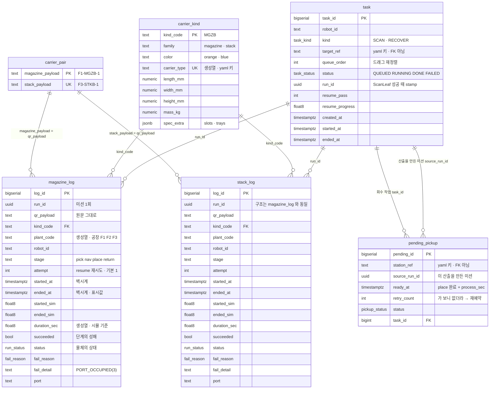
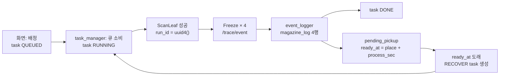

# 🗂 ERD — 표 6개 한 장

> Isaac Sim_협동3 / 24.04+5.x / Development Process
> 본문: [DB구성.md](DB구성.md) — **모든 설계 근거는 거기 있다. 이 문서는 그림과 목록만 갖는다.**
> 상태: 표 1~4 **확정** · 표 5~6 **제안**([DB구성.md §10](DB구성.md))

---

## 이 문서의 역할

`DB구성.md`는 *"왜 이 모양인가"* 를 적은 문서라 길다.
이 문서는 **표 6개가 어떻게 이어지는지만** 한 장에 보여준다. 근거가 궁금하면 각 줄의 §번호를 따라간다.

> ⚠️ **DDL은 여기 두지 않는다.** `DB구성.md`가 유일한 원본이다 —
> 같은 스키마를 두 곳에 적으면 §5-2가 경고한 대로 반드시 갈라진다.

---

# 1. 전체 ERD



📌 **`task` ↔ 로그 2표를 잇는 선은 FK가 아니라 `run_id` 라는 같은 값**이다.
`task` 행이 먼저 생기고(배정), QR을 읽어야 `run_id`가 발행되므로([DB구성.md §4-6](DB구성.md)) 제약으로 걸 수 없다.

---

# 2. 표 6개 요약

| 표 | 행 수 | 누가 쓰나 | 성격 | 근거 |
|---|---|---|---|---|
| `carrier_pair` | 8 | 시드 | 정적 · 매거진↔스택 1:1 | §3 |
| `magazine_log` | N | `event_logger` **만** | **append-only** | §4 |
| `stack_log` | N | `event_logger` **만** | **append-only** · 표 2와 동일 구조 | §4 |
| `carrier_kind` | 4 | 시드 | 정적 · 종류별 규격 | §5 |
| `task` | N | 웹 백엔드 **+** `task_manager` | **가변 · 공유** | §10-2 |
| `pending_pickup` | N | 웹 백엔드 | **가변 · 공유** | §10-3 |

**위 4표와 아래 2표는 성격이 반대다.** 위는 한 노드만 append 하고, 아래는 양쪽에서 UPDATE 한다.
그래서 append-only 원칙(§8-1)은 **위 4표에만** 적용된다.

## 2-1. 표가 되지 못한 것

화면이 요구했지만 DB에 넣지 않은 것들이다. 기준은 §10-1.

> **여러 곳이 동시에 쓰거나 · 죽어도 남아야 하거나 · 집계 대상인 것만 DB.**

| | 어디로 갔나 |
|---|---|
| `shelf` (선반 좌표 · 티칭) | `taught_poses.yaml` |
| `station` (place 자세) | `place.yaml` · 나머지는 `stations.yaml`(신설) |
| `routing_rule` | `stations.yaml`(신설) |
| `robot` (위치 · 배터리 · 상태) | **아무 데도 저장 안 함** — WebSocket 패스스루 |
| `robot.resume_point` | `task.resume_pass` / `resume_progress` 칸 |
| 선반 점유 lock | 칸 없음 — `task`의 부분 UNIQUE INDEX가 파생 (§10-4) |

---

# 3. 뷰 5개가 덮는 것

append-only의 유일한 비용이 *"지금 상태가 뭐냐"* 를 바로 못 읽는 것이고, 뷰가 그것을 갚는다(§6).

```
magazine_log ──┬─→ magazine_latest ──┐
               │   (payload 별 최신)   │
               │                      ├─→ production_tracking
stack_log ─────┼─→ stack_latest ──────┘   (carrier_pair 가 잇는다 · 로트 한 줄)
               │
               └─→ carrier_log ──────────→ run_outcome
                   (표 2 UNION ALL 표 3)     (run_id 별 마지막 행)
```

| 뷰 | 답하는 질문 |
|---|---|
| `magazine_latest` · `stack_latest` | 이 캐리어 지금 어디 있나 |
| `production_tracking` | 이 로트(매거진 + 스택)가 어디까지 갔나 |
| `carrier_log` | 어느 단계·사유에 실패가 몰리나 / 단계별 평균 소요 |
| `run_outcome` | **이 미션이 최종적으로 성공했나 · 사람이 몇 번 살렸나.** 미션 단위 집계는 전부 이걸로 (§4-7) |

`task` · `pending_pickup` 은 뷰를 더 만들지 않는다 — **현재 상태가 행에 그대로 들어 있다.**

---

# 4. 값이 흐르는 순서



**발행 지점이 `Freeze` 하나**인 것이 §9의 핵심이고, **큐를 닫는 고리가 `pending_pickup` → `task`** 인 것이 §10의 핵심이다.
두 고리를 잇는 칸이 `run_id` 하나다(§10-5).

---

# 5. 막혀 있는 것

**그림을 바꾸는 것은 없다.** [DB구성.md §11](DB구성.md)의 열려 있던 넷이 전부 닫혔고,
그 중 둘은 *"표를 만들지 않는다"* 로 끝나서 **표는 6개 그대로**다.

| 닫힌 것 | 그림에 준 영향 |
|---|---|
| `robot_log` 를 만들지 않기로 | **표가 7개로 늘지 않는다.** SCAN 은 전부 soft 가 되어 DB 는 판독 성공 이후만 본다 |
| 같은 `run_id` + `attempt` | 로그 2표에 `attempt` 칸, 뷰에 `run_outcome` 하나가 붙었다 |
| reload 신호 없음 | §2-1의 "yaml로 보낸 것"들은 **뜰 때 한 번 읽는다.** 배선이 늘지 않는다 |
| 공장만 쓰기 | 로그 2표에 `plant_code` 생성열 하나 |

남은 것은 전부 뒤 단계다 — resume 의 포기 처리 · `DOCK` · 표 5·6 확정([DB구성.md §11](DB구성.md)).
